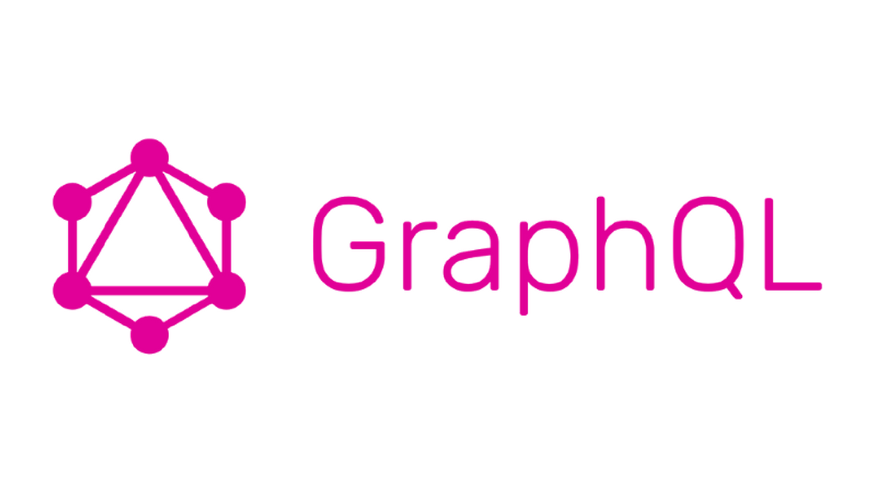
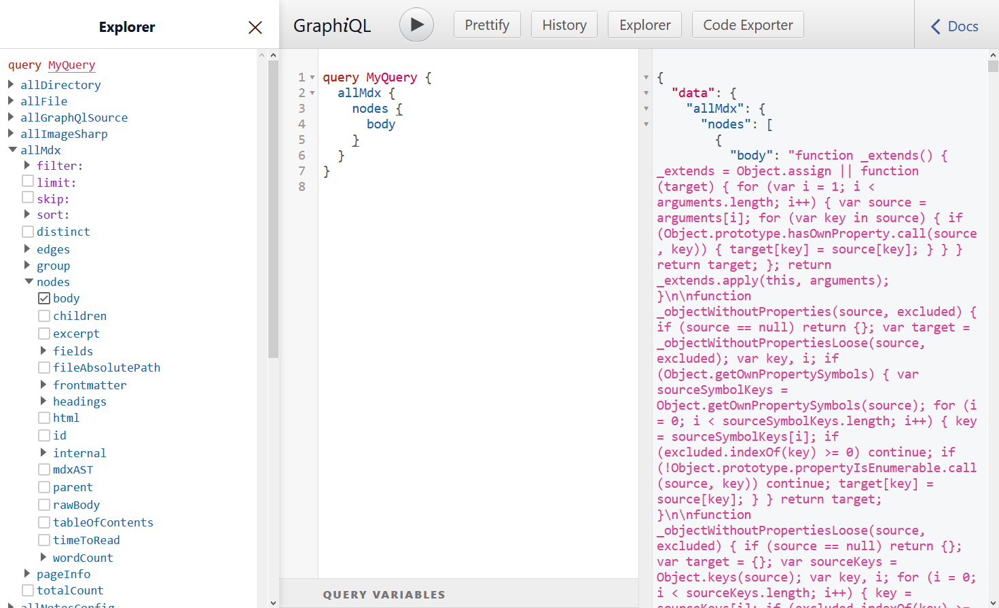
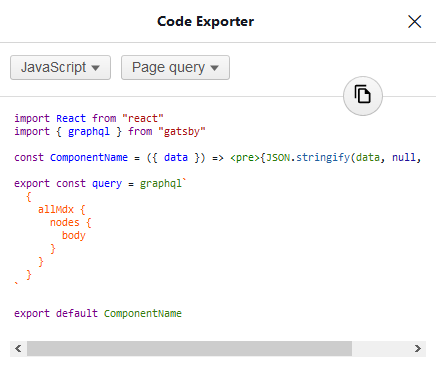
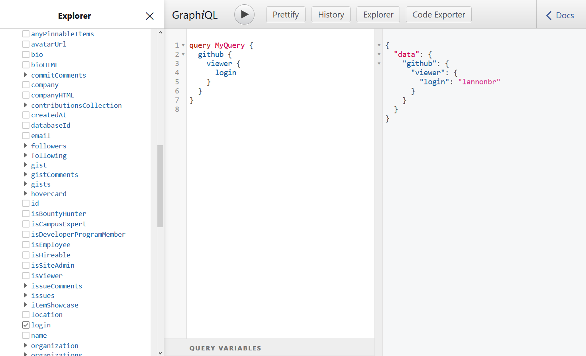

One of the perks of Gatsby is it's centralized data layer which is powered by GraphQL. Rather than explicitly making requests to a bunch of API endpoints or data sources, Gatsby creates a data layer that encompasses all of your endpoints into a single API.

GraphQL as well can be used outside of Gatsby, and provides client and server implementations in most languages, but the usage in Gatsby allows a smooth ease into the technology. The abstractions and features of Gatsby creates layers that as you wish to go deeper and more complex it offers those features progressively rather than all at once.

## Top Layer: Querying Data

Starting out with most Gatsby sites, you may setup some plugins to source data in. From such, you can open up the GraphiQL editor at the `/__graphql` route of the site immediately after the dev server starts with `gatsby develop`.



Gatsby provides OneGraph's [GraphiQL Explorer](https://github.com/OneGraph/graphiql-explorer) out of the box so even if you don't know much about GraphQL's query syntax, you can easily see all fields, choose the ones you want, and click run and view your data.

As well, for the user who just wants to query data, the setup of the "GraphQL server" was abstracted behind Source and Transformer plugins so the user doesn't need to define a schema if they want to stick with the default options of the plugins for their various endpoints.

When it comes time to actually using these queries in React components or Gatsby pages, the query in the editor can be copied over to the files.

```jsx
import React from 'react'
import { graphql } from 'gatsby'

const MDXPage = ({ data }) => <pre>{JSON.stringify(data, null, 4)}</pre>

export const query = graphql`
  {
    allMdx {
      nodes {
        body
      }
    }
  }
`

export default MDXPage
```

That said, as of Summer 2019, [GraphiQL Exporter](https://github.com/OneGraph/graphiql-code-exporter) by OneGraph was also included so you can take the query and wrap it into various formats that can be used in Gatsby:



This layer of just querying data exposes a straightforward way to obtain data for components or pages, and is the most approachable out of all of the various APIs, but diving one layer down, customizing the schema dives into the top layer of defining GraphQL types.

## Going deeper: Schema Customization

Explicit definition of parts of the GraphQL schema can empower a developer further as they wish to go deeper into GraphQL. Gatsby creates abstractions around such with their Schema Customization API. You define types by either using GraphQL's [Schema Definition Language](https://graphql.org/learn/schema/) (SDL) or with Gatsby's object-based [Type Builders](https://www.gatsbyjs.org/blog/2019-03-18-releasing-new-schema-customization/#the-type-builder-api).

One of the simplest walkthroughs is explicitly defining some types for the frontmatter of a MDX node. This will defined in the example below using the SDL syntax.

```js title=gatsby-node.js
exports.createSchemaCustomization = ({ actions }) => {
  const { createTypes } = actions

  const typeDefs = `
    type MdxFrontmatter {
      title: String!
      author: String!
      categories: [String]
    }
  `

  createTypes(typeDefs)
}
```

By default, Gatsby infers the schema based on data it is given, so if you add new fields to a MDX file's frontmatter, it will automatically add them to the field, but by defining it explicitly, we can state if a field is required or if it is optional, it will return null. Schema Customization starts with defining types, but can be extended further by using more tools from GraphQL.

## The Core: GraphQL Advanced features

Going fairly deep into the GraphQL APIs in Gatsby, Interfaces, Extensions, and Resolvers provide some of the lowest level of control with the data layer.

Starting out with interfaces, if we wish to create abstract data types (BlogPost, Podcast, Event, etc), Interfaces can bring such. For example, we may want to define a BlogPost interface that has some commonly found fields for blog posts. This can be done the same way types can be explicitly be defined using the Schema Customization API with createTypes:

```js
exports.createSchemaCustomization = ({ actions }) => {
  const { createTypes } = actions

  const typeDefs = `
    interface BlogPost @nodeInterface {
      id: ID!
      title: String!
      author: String!
      date: Date!
      body: String!
    }

    type MDXBlogpost implements Node & BlogPost {
      title: String!
      author: String!
      date: Date!
      body: String!
    }
  `

  createTypes(typeDefs)
}
```

Then, we can create types that implement this interface (MDX, Contentful, Wordpress, etc) and when one queries on the `allBlogPost`, all nodes that implement that interface will be obtained. A usecase of this can be seen in the [gatsby-theme-blog-core](https://github.com/gatsbyjs/gatsby/tree/master/themes/gatsby-theme-blog-core) which defines a `BlogPost` interface and a `MDXBlogPost` type.

---

On top of such, you may want to add functionality to specific fields in a node. For instance, we could create an extension that defines an `allCaps` mode that capitalizes all letters in a string. using another action in createSchemaCustomization, `createFieldExtension`, this can be done:

```js
exports.createSchemaCustomization = ({ actions }) => {
  const { createTypes, createFieldExtension } = actions

  createFieldExtension({
    name: 'allCaps',
    extend(options, prevFieldConfig) {
      return {
        resolve(source, args, context, info) {
          const fieldValue = context.defaultFieldResolver(
            source,
            args,
            context,
            info
          )
          return String(fieldValue).toUpperCase()
        },
      }
    },
  })

  const typeDefs = `
    interface BlogPost @nodeInterface {
      id: ID!
      title: String!
      author: String!
      date: Date!
      body: String!
    }

    type MDXBlogpost implements Node & BlogPost {
      title: String!
      author: String! @allCaps
      date: Date!
      body: String!
    }
  `

  createTypes(typeDefs)
}
```

The extension uses the default resolver of the field it grabs to get the value to be modified by the extension and then returns the string after calling `toUpperCase` on it.

---

Finally, Resolvers are the tool to grab data when a GraphQL query is executed. One instance of creating new resolvers is if you wish to make completely new fields to the root `Query`. The `createResolvers` API allows access to such tools. Below we can use the `BlogPost` type from earlier and create a new entry to the root query to get all posts that are by the author George:

```js title=gatsby-node.js
exports.createResolvers = ({ createResolvers }) => {
  const resolvers = {
    Query: {
      allPostsByGeorge: {
        type: [`BlogPost`],
        resolve: (source, args, context, info) => {
          const posts = context.nodeModel.getAllNodes({ type: `BlogPost` })
          const georgePosts = posts.filter(post => {
            return post.author === `George`
          })
          return georgePosts
        },
      },
    },
  }

  createResolvers(resolvers)
}
```

Gatsby does have some abstractions to get nodes in the existing data layer such as `context.nodeModel.getAllNodes`, but it is almost to the root of the implementation on how queries are executed.

## Going Beyond: Creating GraphQL servers & sourcing using gatsby-source-graphql

If a GraphQL Server should live outside of Gatsby's domain, it still can be brought back into Gatsby with the `gatsby-source-graphql` plugin which allows to hook up to any GraphQL endpoint. If you wish to learn how to spin up a standalone GraphQL server, [How To GraphQL](https://www.howtographql.com/) has guides on how to set up a server in languages like Node, Elixer, Ruby, Java, Python, and Scala.

For this usecase, let's pull in GitHub's API for now and integrate it with the source plugin (but your own API could be put into this example and used similarly). In your gatsby-config.js file, the plugin is set up by defining how it should live in Gatsby's GraphQL layer, where the endpoint is, and any headers for credentials if needed.

```js title=gatsby-config.js
module.exports = {
  plugins: [
    {
      resolve: 'gatsby-source-graphql',
      options: {
        typeName: 'GitHub',
        fieldName: 'github',
        url: 'https://api.github.com/graphql',
        headers: {
          Authorization: `Bearer ${process.env.GITHUB_TOKEN}`,
        },
        fetchOptions: {},
      },
    },
  ],
}
```

And then it is immediately consumable across GraphiQL and the rest of the Gatsby ecosystem:



## Conclusion

Each of these tools provided by Gatsby and GraphQL build up on each other and explore the depths of the language as you learn more features progressively. With such, most people likely aren't making resolvers or creating tons of custom field extensions, but the APIs allow people who want to extend the schema at large to do so. Compared to being thrown into the entire language at once, this step-by-step way of learning gives a better focus and stronger context as it is coupled to Gatsby and gives strong purpose for each layer. There are other pathways, but this specific flow exposes a strong pattern of exposing less commonly used features deeper in a toolchain or UI, coined by the Nielsen Norman Group as Progressive Disclosure. Their initial purpose is for just UI, but as I showed, it can also layer into other spaces. If you want to read through another example further, take a look at Jason Lengstorf's post, [Automation + Control: Progressive Disclosure of Complexity](https://lengstorf.com/progressive-disclosure-of-complexity/).
