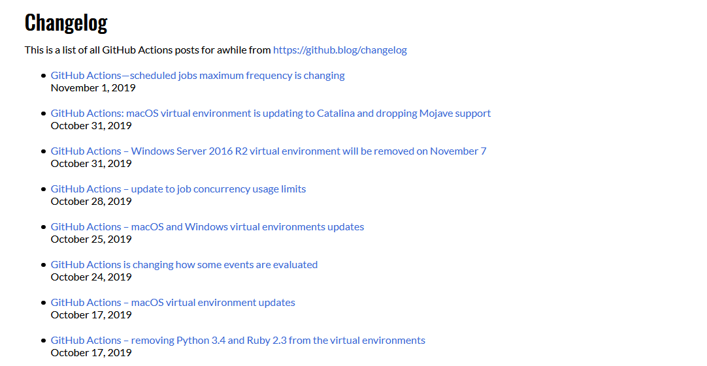
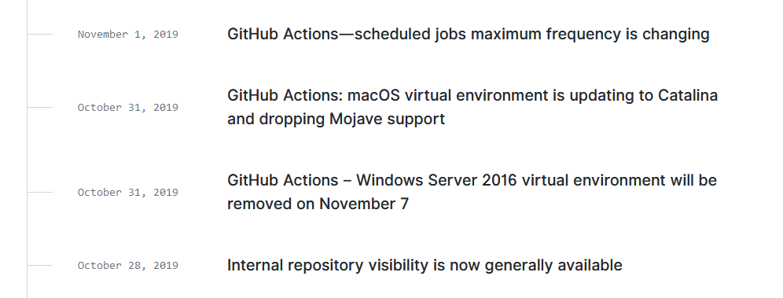
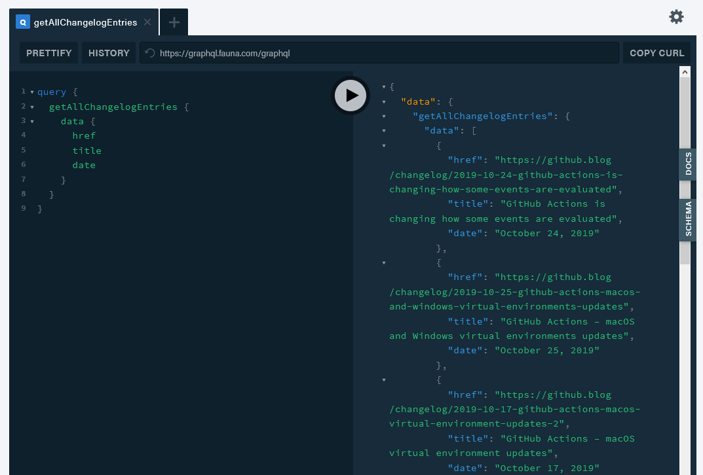

Over the past week, I spun up a new workflow with GitHub Actions for an upcoming site of mine where I will be pushing resources and other content for GitHub Actions. For one of the pages, I wanted to get all updates on Actions from [GitHub's Changelog](https://github.blog/changelog/) and display them as a list.



After a few sessions, I got a scheduled workflow to scrape the page, filter out tasks, send it to a database if it is not already saved, and then rebuild the site if there are new entries. I wanted to do a dive on the flow and highlight some things that made Actions fluid to work with for this use case.

Here's some links to the workflow and action which I will reference through the article:

- [changelog-pull-action](https://github.com/lannonbr/ActionsResourceSite/tree/master/.github/actions/changelog-pull-action)
- [changelog-update.yml](https://github.com/lannonbr/ActionsResourceSite/blob/master/.github/workflows/changelog-update.yml)

## Scraping GitHub

Starting off, as GitHub's changelog doesn't have an API, I had to go in and scrape it manually. A route I went down was used the node module [cheerio](https://www.npmjs.com/package/cheerio) which provides a jQuery syntax to be able to parse and pick out the data of what I wish.

Once the page was pulled down with a package like `node-fetch`, I could dive through the HTML to get just the content I wish. Looking at the content of the actual site, there are 3 items that can be extracted:

- The post's date
- The post's title
- The post's link



With this as the elements were nicely structured, I could pluck out the data using cheerio and some array methods. Once I have filtered down all of the posts from the HTML, I do one more filter to include posts that only include the string "Action".

Now, I needed to check the post entries already saved in my database and only upload new ones.

## Fauna writes

I decided to use [Fauna](https://fauna.com/) to experiment with the tool. It provides a simple document datastore that is managed for you with minimal setup and a GraphQL client which then can be easily integrated into a Gatsby site down the pipeline.

Pulling down entries from Fauna are done with their query language, FQL. I used the JavaScript client which sticks fairly close to the FQL standard.

```js
const getPostsFromFauna = async () => {
  let faunaPosts = []

  return client
    .paginate(q.Match(q.Index('all_changelog_entries')))
    .map(ref => q.Get(ref))
    .each(page => {
      page.map(doc => {
        faunaPosts.push(doc)
      })
    })
    .then(() => {
      return faunaPosts
    })
    .catch(err => {
      console.error('Failed to pull down fauna posts')
      console.error(err)
    })
}
```

The main meat of the code here sends a request to get a paginated results from what Fauna calls an `Index` which is a way to take a collection of data and filter and sort it in the DB layer rather than in a client which reduces reads from the DB. this `all_changelog_entries` index just returns all of the entries in this collection without any filtering as we will want to check all of the posts one by one. In the future this could be improved to only grab posts in the last few weeks compared to all posts.

Now that both the posts from Fauna and from GitHub's site are both loaded, I check each of the GitHub entries and if they aren't already in the database, I will upload them.

```js
const addPostToFauna = async post => {
  try {
    await client.query(
      q.Create(q.Collection('changelog_entries'), {
        data: post,
      })
    )
  } catch (err) {
    console.error('Failed to create new fauna document')
    console.log(err)
  }
}
```

Each time this is run, I increment a counter of new posts added which will be exposed for later usage.

## GraphQL with ease

As I said earlier, Fauna supports GraphQL natively. By uploading a GQL schema, you can structure your data and define queries you want to be able to use.

```graphql
type changelog_entries {
  href: String!
  title: String!
  date: String!
}

type Query {
  getAllChangelogEntries: [changelog_entries!]
}
```

Some magic Fauna does behind the scenes is that it will generate new indexes based upon the fields you insert into the `Query` type when it matches up to a collection that already exists in a database. As there are no directives or parameters on the query field, it will be an index that returns all items. Following, Fauna's dashboard provides a GraphQL playground you can use to run queries or mutations with this newly defined schema. As you can see below, it grabs the content that was stored:



And then when I wish to pull it into a Gatsby site, I can use the `gatsby-source-graphql` plugin and source the content from Fauna into Gatsby's GraphQL layer.

## Conditional Workflow

Coming back to the workflow itself, I could rebuild the site every time it ran, but I also could simplify the run and only rebuild the site if needed. I used the `outputs` feature of GitHub Actions which lets you expose some data from one action to be used in other parts of the workflow. In the step to run the action, I provide an id so I can reference it in other steps

```yaml
- uses: ./.github/actions/changelog-pull-action
  id: changelog_pull
  env:
    FAUNADB_TOKEN: ${{ secrets.FAUNADB_TOKEN }}
```

In the step afterwards, the `if` field checks an output from said action called `newFaunaPostsAdded` and if that field is not 0, then we know to run the action to build the site and deploy to Netlify.

```yaml
- name: Build if new posts
  if: steps.changelog_pull.outputs.newFaunaPostsAdded != 0
  env:
    NETLIFY_SITE_ID: ${{ secrets.NETLIFY_SITE_ID }}
    NETLIFY_AUTH_TOKEN: ${{ secrets.NETLIFY_AUTH_TOKEN }}
    FAUNADB_TOKEN: ${{ secrets.FAUNADB_TOKEN }}
  run: |
    yarn
    yarn build
    npx netlify-cli deploy --dir=public --prod
```

This workflow is run 4 times a day and has been working for a week without any effort on my end which shows the benefit of spinning this into an Action.

## Conclusions

Through all of this work, I came out with a fully autonomous toolchain to rebuild the site when new posts are up on GitHub's changelog. With such, I have a few things to some things to leave you with and ideas for the future.

- Conditional workflows: Setup workflows so if you don't need to run through every step 100% of the time. This will become very useful in private repos as you have usage cap for free and will have to pay afterwards.
- Refining queries: No matter which type of database you use to store data in a scenario like this, narrowing the queries will be beneficial for all parties. I am planning on creating some Fauna indexes in this situation so as time goes on and more and more posts are added, the array of posts pulled down can stay small and fast.

Although this workflow was built for a specific toolchain, a lot of the insights can be reused bring these powerful between GitHub, external services, and your projects.
