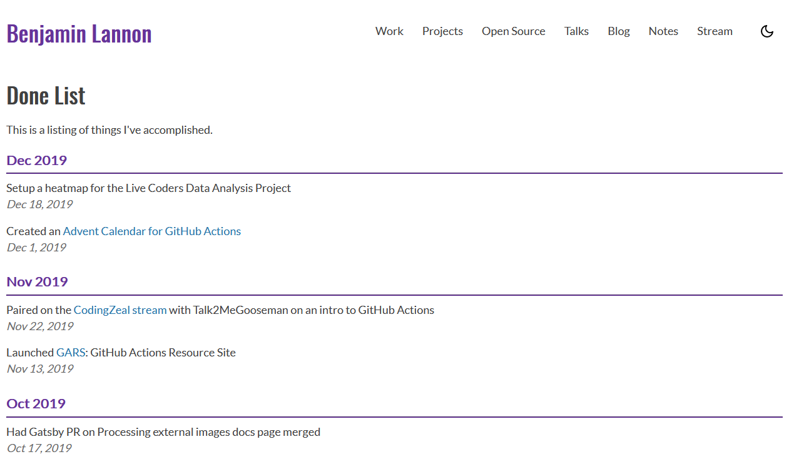

While watching a stream last week by [MPJ](https://twitter.com/mpjme), a discussion occured about flipping a "Todo list" on it's head and instead of making lists of things you wish to do, instead make a "Done list". So reflect on the things that I have done. I liked this idea so much that I created a new page on my site specifically for this. [lannonbr.com/done/](/done/)

With these kinds of things, I don't want to bog down myself about the process or if I am frequently adding things to this list, but rather have it be painless to contribute to. If I did something worth writing down, I can open a file in my repo, write it down, and make a commit. Doesn't have to be 4 paragraphs about what I did or how I did it, just a single sentence.

With something like this, I can then be able to look back over a period of time and be able to see all of the things I did at a high level. I pushed a lot of things from this past year and hope to make it a habit of contributing to this list.
