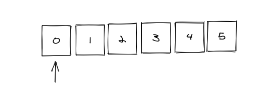
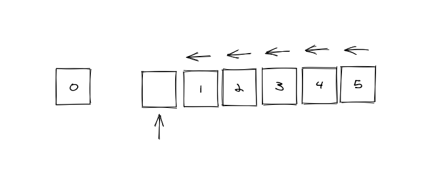
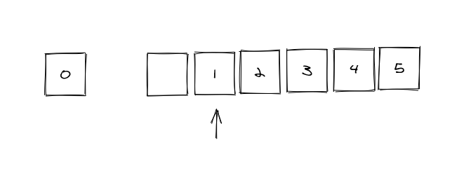

When working with arrays in Javascript, there's two sets of functions if you want to add or remove items to an array to a certain end of the array.

- `shift` / `unshift`: remove / add items at the front of the array.
- `pop` / `push`: remove / add items at the end of an array.

I had a scenario where using `shift` acted differently than I expected and lead to some interesting results.

## How Array.shift works

By definition on [MDN](https://developer.mozilla.org/en-US/docs/Web/JavaScript/Reference/Global_Objects/Array/shift):

> The shift method removes the element at the zeroeth index and shifts the values at consecutive indexes down, then returns the removed value. If the length property is 0, undefined is returned.

It will take an item off the array and shift every other item over.

Let's have an example with a simple array of size 6 counting the numbers 0-5.



If you ran this code on it:

```js
let arr = [0, 1, 2, 3, 4, 5]
array.shift()
```

It would return the number `0` and the array remaining would be `[1, 2, 3, 4, 5]`. Now that's fine for a small array as it shifted the 5 remaining items over.



but what if we had an array of size 100,000? Or what if the items of the array were complex objects? Thinking about this algorithm simply, it does not scale as you would need to traverse a large amount of data every time you ran `array.shift()`.

I was working on a codebase that ran into this bottleneck, but what perplexed me was how in Firefox it ran almost instantly while in Node / Chrome it took seconds to complete. To figure out how this actually worked, I dug around and found some inner workings of how Firefox implements this function which gives it a huge performance boost.

## Perf Boost with Pointers

When thinking about JavaScript runtimes which the JS will be run on, not all work the same. JS that runs in Chrome may run faster or slower in Firefox, Safari, etc. There is standards around the JS language and how it should behave, but how each function or algorithm is implemented is up to the people building these JS runtimes.

In the case of Firefox, their engine is called SpiderMonkey which is mainly written in C / C++. With that being the case, arrays in C are pointers that tell a computer at what memory address is the beginning of an array. Up till 2017, the `array.shift` method that was implemented in SpiderMonkey was a slow implementation that it had to move items one by one. In 2017, though, some engineers at Mozilla had [an idea](https://jandemooij.nl/blog/2017/12/06/some-spidermonkey-optimizations-in-firefox-quantum/): what if instead of moving the items one by one in a shift, you just move the pointer or tell the computer a new address to where the array starts.



So now there is just 2 computations in the end.

1. Moving the first item off the array.
1. Move the pointer of the front of the array over by one.

In terms of time complexity, this reduces a linear process to a constant process (O(n) to O(1)). So no matter the size of the array, on average the shift would happen instantly.

## End Results

So we found out that `array.shift` is now fast in Firefox, so we can stick with it and move on with our day? It would be great, but sadly no. As this project that lead me to discover these details is a universal JS package, it should be able to run on any JS runtime with comparable performance. Chrome has a similar algorithm, but it only works for arrays under size of ~50k items (A story for another day). So in the end, `shift` wasn't going to pan out when working with large arrays in this case, but the sleuthing I did provided an example that programming language specifications and implementations can differ and give the creative freedoms for the engineers building these runtimes or compilers to highly optimize these internal functions to great extents.
