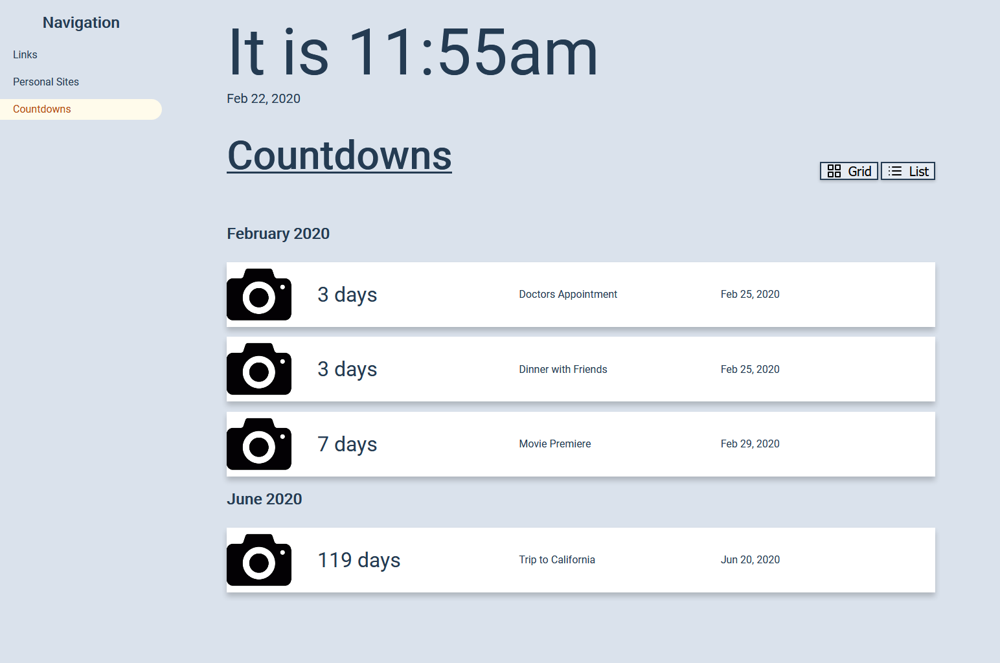

When I open my web browser, there is a page I developed where I can see upcoming events.



To extend this to be timely and relevant, I setup a GitHub Actions workflow that grabs the upcoming week's alerts and sends a text message using Twilio to notify me when I get into work on Mondays what is upcoming in the week. This is going to walk through how that workflow was implemented

## Setup Twilio

For notice, Twilio offers a free trial but afterwards a phone number usually only costs $1.00 a month and $0.0075 per SMS. If you don't have a Twilio account, go through the [how to use your free trial account walkthrough](https://www.twilio.com/docs/usage/tutorials/how-to-use-your-free-trial-account).

Next, follow the steps in the [Node Quickstart](https://www.twilio.com/docs/sms/quickstart/node#sign-up-for-twilio-and-get-a-twilio-phone-number) in the Twilio Docs to purchase a phone number and get the account SID and auth token. You can stop after the "Send an Outbound SMS Message with Node.js" step as that is all that is needed for this.

## Create our data

Now, we will create a JSON file that will be where all of our events will be stored.

```json title=countdowns.json
[
  {
    "title": "Doctors Appointment",
    "date": [2020, 1, 25]
  },
  {
    "title": "Dinner with Friends",
    "date": [2020, 1, 25]
  },
  {
    "title": "Movie Premiere",
    "date": [2020, 1, 29]
  },
  {
    "title": "Trip to California",
    "date": [2020, 5, 20]
  }
]
```

Each entry will have a title and date. Note the month which is the 2nd number in the array starts counting at 0. So 1 is February in this case.

## The Node script

The script needs two external node modules: `moment` to do some date math and `twilio` to send the SMS using Twilio's APIs

```
npm init
npm install moment twilio
```

Then, the script is as follows

```js
const fs = require('fs')
const path = require('path')
const moment = require('moment')
const twilio = require('twilio')

let thisWeekEvents = []

// Dynamically load in the JSON
const countdowns = JSON.parse(
  fs.readFileSync(path.join(__dirname, '..', 'countdowns.json')).toString()
)

// Filter through all of the events taht are in the next 7 days from right now
countdowns.forEach((event) => {
  let hoursTillEvent = moment(event.date).diff(moment(), 'hours')

  if (hoursTillEvent > -1 && hoursTillEvent < 24 * 7) {
    thisWeekEvents.push(event)
  }
})

// if we have events, start creating the body of the SMS message
if (thisWeekEvents.length > 0) {
  let str = `This week's events (${moment().format('ll')})\n`

  thisWeekEvents.forEach((event) => {
    str += '- ' + event.title + '\n'
  })

  let client = twilio(process.env.twilio_sid, process.env.twilio_auth_token)

  // then pass it through the twilio client and make the call
  client.messages
    .create({
      body: str,
      from: process.env.from_num,
      to: process.env.to_num,
    })
    .then((message) => console.log(message))
    .catch((err) => console.error(err))
}
```

Then be sure to bundle it down so when we push the code up to GitHub, all of the code is available. Check out [Bundling NPM modules for use in GitHub Actions](/blog/2020-02-23-github-actions-webpack/) for a reference on how to do this.

## GitHub Actions Workflow

Next we can setup a workflow file that will trigger this once a week.

```yml title=weekly-text.yml
name: Weekly Text Workflow
on:
  schedule:
    - cron: '0 12 * * 1' # 12PM UTC on Mondays -> 7AM ET

jobs:
  send_text:
    name: 'Twilio Notification'
    runs-on: ubuntu-latest
    steps:
      - uses: 'actions/checkout@v2'
      - name: 'Send Text'
        env:
          twilio_sid: ${{ secrets.twilio_sid }}
          twilio_auth_token: ${{ secrets.twilio_auth_token }}
          from_num: ${{ secrets.from_num }}
          to_num: ${{ secrets.to_num }}
        run: node dist/index.js
```

The various credentials can be setup in the Secrets tab under the settings for the Repository.

Once deployed to GitHub, every Monday at 7AM ET, a message will appear on my phone letting me know what is upcoming in the week. This could be improved and extended in multiple ways including:

- Pulling from better data sources (Google Calendar / Outlook Calendars)
- Have more workflows so if something has a high priority, you could get a SMS the day of
