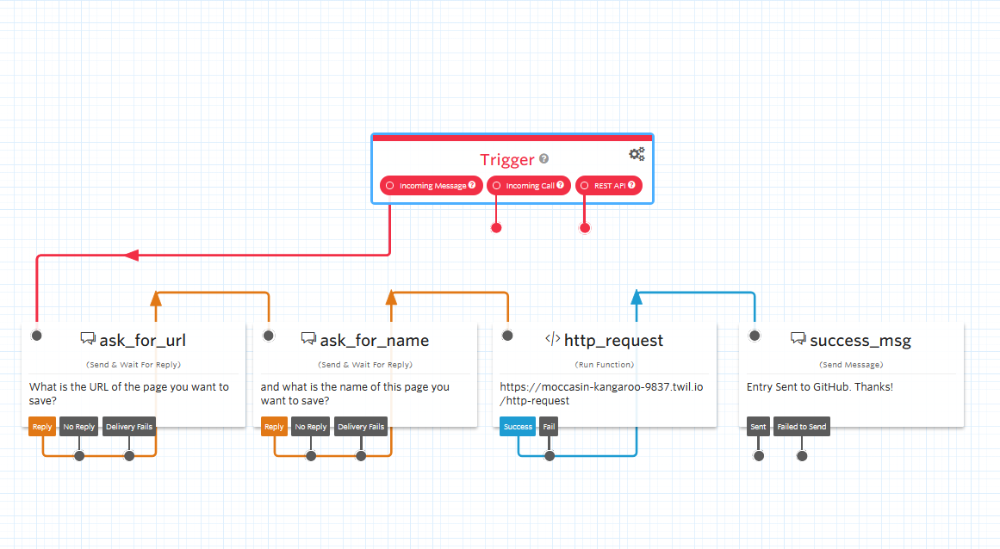

Talk about Followup Friday

A few weeks back, [ChefBrent](https://twitch.tv/chefbrent) started a new show every friday called "Follow-up Friday". The premise is that you may find tons of things through a week during the day. News stories, new software projects, etc. With that, if you don't write it down to look over at a later time, you likely won't remember it. His new weekly show tries to mitigate that and have a scheduled time every week to pull up those topics and look over them.

I created a page on my site to list these topics for things I find myself, but I wanted to make ways for it to be as easy as possible to add to the list without needing to open a markdown file and make a commit by hand every time I find a new thing. With a combination of Twilio and GitHub Actions, I was able to automate this process.

## Frontend: Twilio Studio

I also spun up a flow in [Twilio Studio](https://www.twilio.com/studio) which allows for a SMS flow with a drag-n-drop interface.



Steps:

- Ask for URL, save to variable
- Ask for name, save to variable
- send data over to Twilio function to send HTTP request as done in previous frontend

```js title=function.js
exports.handler = function(context, event, callback) {
  const fetch = require('node-fetch')

  fetch('https://api.github.com/repos/lannonbr/Portfolio-Gatsby/dispatches', {
    method: 'POST',
    headers: {
      Authorization: 'token ' + process.env.ACCESS_TOKEN,
      Accept: 'application/vnd.github.everest-preview+json',
      'Content-Type': 'application/json',
    },
    body: JSON.stringify({
      event_type: 'followup_new_entry',
      client_payload: {
        name: event.name,
        url: event.url,
      },
    }),
  }).then(resp => callback())
}
```

## GitHub Action portion

Once the data is then sent to the GitHub Actions workflow, we can save it to the markdown file in my site and then commit and deploy the changes.

Steps:

```js title=followup-entry-action/index.js
const fs = require('fs')
const path = require('path')

const name = process.env.INPUT_NAME
const url = process.env.INPUT_URL

let page = fs
  .readFileSync(
    path.join(process.env.GITHUB_WORKSPACE, 'content', 'notes', 'followup.md')
  )
  .toString()

let content = page.split('\n')

content.splice(2, 0, `- [${name}](${url})`)

fs.writeFileSync(
  path.join(process.env.GITHUB_WORKSPACE, 'content', 'notes', 'followup.md'),
  content.join('\n')
)
```

- Open up markdown file for follow-up list with `fs` node module
- append new entry and then save back to the file

```yaml title=followup-entry.yml
name: Create Follow Up Entry
on:
  repository_dispatch:
    types: [followup_new_entry]
jobs:
  run:
    env:
      LIFX_TOKEN: ${{ secrets.LIFX_TOKEN }}
      LIFX_BULB_ID: ${{ secrets.LIFX_BULB_ID }}
    runs-on: ubuntu-latest
    steps:
      - uses: actions/checkout@v2
      - uses: ./.github/actions/followup-entry-action
        with:
          name: ${{ github.event.client_payload.name }}
          url: ${{ github.event.client_payload.url }}
      - run: |
          git config user.name "GitHub Actions Bot"
          git config user.email "<>"

          git add content/notes/followup.md
          git commit -m "New Follow up Topic"
          git push origin master

          yarn
      - name: Build Site
        env:
          GITHUB_TOKEN: ${{ secrets.GH_TOKEN }}
        run: yarn build
      - name: Deploy Site
        env:
          NETLIFY_SITE_ID: ${{ secrets.NETLIFY_SITE_ID }}
          NETLIFY_AUTH_TOKEN: ${{ secrets.NETLIFY_AUTH_TOKEN }}
        run: npx netlify-cli deploy --dir=public --prod
      - name: Trigger light to go green on success
        if: success()
        uses: lannonbr/lifx-trigger-action@1.0.0
        with:
          color: green
      - name: Trigger light to go red on failure
        if: failure()
        uses: lannonbr/lifx-trigger-action@1.0.0
        with:
          color: red
```

- do a [git commit](/blog/2019-12-09-git-commit-in-actions/)
- build the site
- deploy the site with `netlify-cli`
