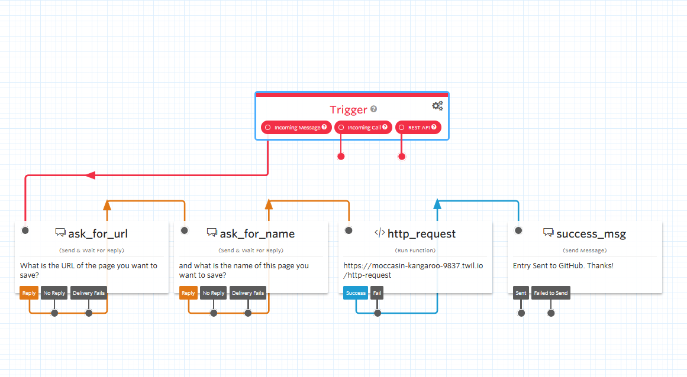
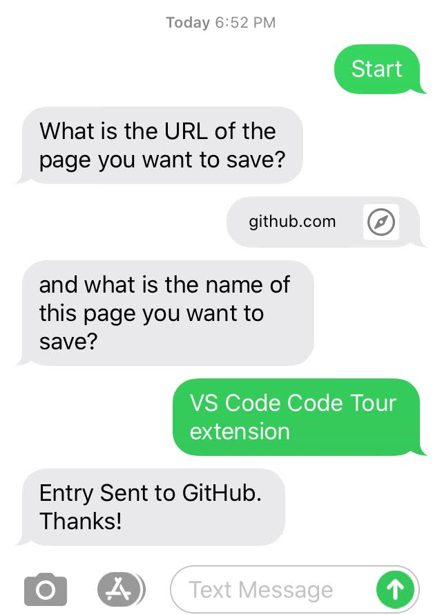

A few weeks back, [ChefBrent](https://twitch.tv/chefbrent) started a new show every Friday called "Follow-up Friday". The premise is that you may find tons of things through a week during the day. News stories, new software projects, etc. With that, if you don't write it down to look over at a later time, you likely won't remember it. His new weekly show tries to mitigate that and have a scheduled time every week to pull up those topics and look over them.

I created a page on my site to list these topics for things I find myself, but I wanted to make ways for it to be as easy as possible to add to the list without needing to open a markdown file and make a commit by hand every time I find a new thing. With a combination of Twilio and GitHub Actions, I was able to automate this process.

## Programmatic SMS with Twilio

To start, I wanted to build a SMS bot that would handle the collection of a title for an entry and the URL that it goes to. Instead of writing a full node script to do all of this and pause execution while I wait for the response or handle timeout and other things, Twilio Studio allowed me to abstract a lot of this. [Twilio Studio](https://www.twilio.com/studio) allows for a SMS flow with a drag-n-drop interface. The entire flow in Twilio is below.



I start by asking for the two variables, then pass it through to a Twilio function that manages the HTTP call. There is a widget for HTTP requests, but it doesn't allow for custom request headers, so I fellback to a serverless function deployed to Twilio.

```js title=function.js
exports.handler = function(context, event, callback) {
  const fetch = require('node-fetch')

  fetch('https://api.github.com/repos/lannonbr/Portfolio-Gatsby/dispatches', {
    method: 'POST',
    headers: {
      Authorization: 'token ' + process.env.ACCESS_TOKEN,
      Accept: 'application/vnd.github.everest-preview+json',
      'Content-Type': 'application/json',
    },
    body: JSON.stringify({
      event_type: 'followup_new_entry',
      client_payload: {
        name: event.name,
        url: event.url,
      },
    }),
  }).then(resp => callback())
}
```

It sends the two variables over to GitHub with a `repository_dispatch` webhook that is exposed as part of a GitHub Actions workflow. Do note a GitHub personal access token is required in the HTTP call as repository_dispatch requires authenticated API access.

If I actually use this, it will go through the workflow that we set up:



## Building with GitHub Actions

Once the data is then sent to the GitHub Actions workflow, we can save it to the markdown file in my site and then commit and deploy the changes.

As I want to setup a webhook for this, I use `repository_dispatch` and specify the event type in the `types` field:

```yaml
on:
  repository_dispatch:
    types: [followup_new_entry]
```

I first pass the input data into a node script to write a new line in the markdown file at the top of the list which occurs at line 3 of the file.

```js title=followup-entry-action/index.js
const fs = require('fs')
const path = require('path')

const name = process.env.INPUT_NAME
const url = process.env.INPUT_URL

let page = fs
  .readFileSync(
    path.join(process.env.GITHUB_WORKSPACE, 'content', 'notes', 'followup.md')
  )
  .toString()

let content = page.split('\n')

content.splice(2, 0, `- [${name}](${url})`)

fs.writeFileSync(
  path.join(process.env.GITHUB_WORKSPACE, 'content', 'notes', 'followup.md'),
  content.join('\n')
)
```

Once that is done, I run a git commit and push back to the repo.

```yaml
- name: Commit file
  run: |
    git config user.name "GitHub Actions Bot"
    git config user.email "<>"
    git add content/notes/followup.md
    git commit -m "New Follow up Topic"
    git push origin master
```

Then I continue with the remainder of my usual build steps of building and deploying the site.

```yaml
- name: Build Site
  env:
    GITHUB_TOKEN: ${{ secrets.GH_TOKEN }}
  run: |
    yarn
    yarn build
- name: Deploy Site
  env:
    NETLIFY_SITE_ID: ${{ secrets.NETLIFY_SITE_ID }}
    NETLIFY_AUTH_TOKEN: ${{ secrets.NETLIFY_AUTH_TOKEN }}
  run: npx netlify-cli deploy --dir=public --prod
```

In summary, this is the entire workflow file that runs the backend of this flow.

```yaml title=followup-entry.yml
name: Create Follow Up Entry
on:
  repository_dispatch:
    types: [followup_new_entry]
jobs:
  run:
    runs-on: ubuntu-latest
    steps:
      - uses: actions/checkout@v2
      - uses: ./.github/actions/followup-entry-action
        with:
          name: ${{ github.event.client_payload.name }}
          url: ${{ github.event.client_payload.url }}
      - run: |
          git config user.name "GitHub Actions Bot"
          git config user.email "<>"

          git add content/notes/followup.md
          git commit -m "New Follow up Topic"
          git push origin master
      - name: Build Site
        env:
          GITHUB_TOKEN: ${{ secrets.GH_TOKEN }}
        run: |
          yarn
          yarn build
      - name: Deploy Site
        env:
          NETLIFY_SITE_ID: ${{ secrets.NETLIFY_SITE_ID }}
          NETLIFY_AUTH_TOKEN: ${{ secrets.NETLIFY_AUTH_TOKEN }}
        run: npx netlify-cli deploy --dir=public --prod
```

## Conclusions

Now when I want to add a new entry, I can pull out my phone or iPad and send a text message and within a few minutes everything will be deployed out to my site. In terms of pricing, Twilio Studio gives a free tier of 1000 calls of the Studio flow so for my limited use, I only have to pay for a phone number and SMS send / receive calls. If I say add 10 posts a month, it comes out to being $1.45 a month on the Twilio end ($1.00 for the phone number, $0.0075 / call \* 6 calls per flow \* 10 entries = $0.45) and the GitHub Actions end doesn't cost a cent since it is being run in a public repo.

On top of this, as the GitHub actions portion is just a webhook, I could create other frontends like a CLI app or a browser extension and I never have to touch any of the code on GitHub for it to work as expected. This flow as well can work for plenty of other ideas and allow to interact with platforms by just sending a message to a phone number. This started as an idea to automate a fairly straightforward task and within a few hours of work got it fully up and running.
