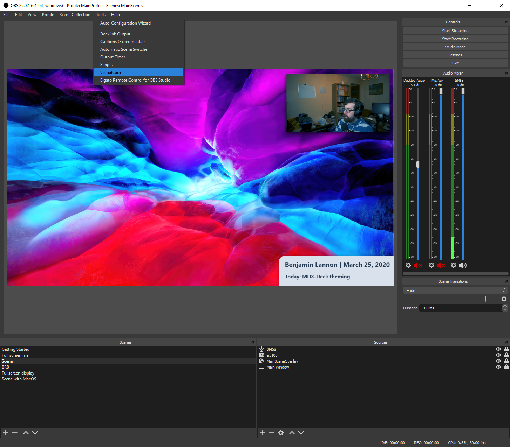
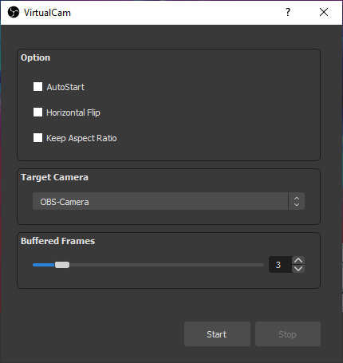

When I livestream on Twitch, I have setup various sources to add in overlays, add filters, and be able to switch between various scenes in OBS. Though, I want to take all of these things into other video communication apps which I use my webcam, and with an OBS plugin, this is possible.

CatxFish on GitHub created an OBS plugin called [obs-virtual-cam](https://github.com/CatxFish/obs-virtual-cam) which installs virtual webcams which can playback your video output coming from OBS. It requires you have at least OBS 24.0.0 installed.

<Warning>
Do note this plugin is only supported on Windows at the moment.
</Warning>

In the releases tab in GitHub, there is an installer which will install the various drivers and plugin needed for this to work. Once you install it, if you go to the tools menu bar in OBS, there is a VirtualCam option.

Inside it, it will show some options on if it should autostart when you open OBS or if you want to flip the output horizontally. What is important is you will have a target camera which was created when the plugin was installed. Depending on the install, you can have either one or multiple of these running at the same time.

Then when you hit the `start` button on the bottom, it is now ready to go. If you open an app like Zoom and configure your video, on top of the webcam you are using, you can choose `OBS-Camera` which is the video output coming from OBS. Now all of the functionality in OBS will be available to be used in other apps as if it was just another webcam on your system.
