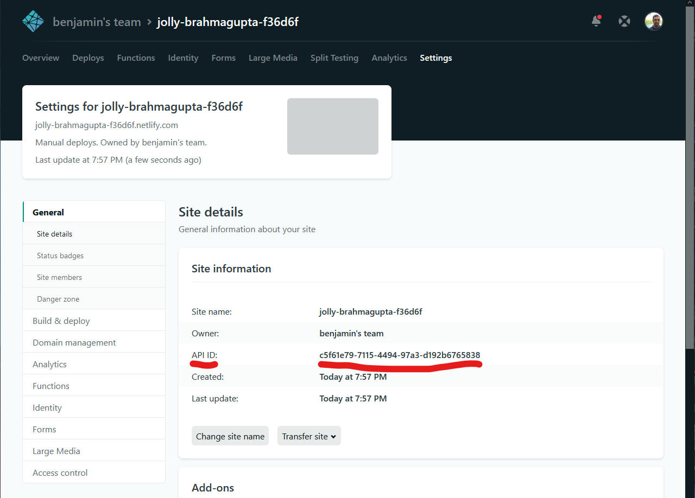
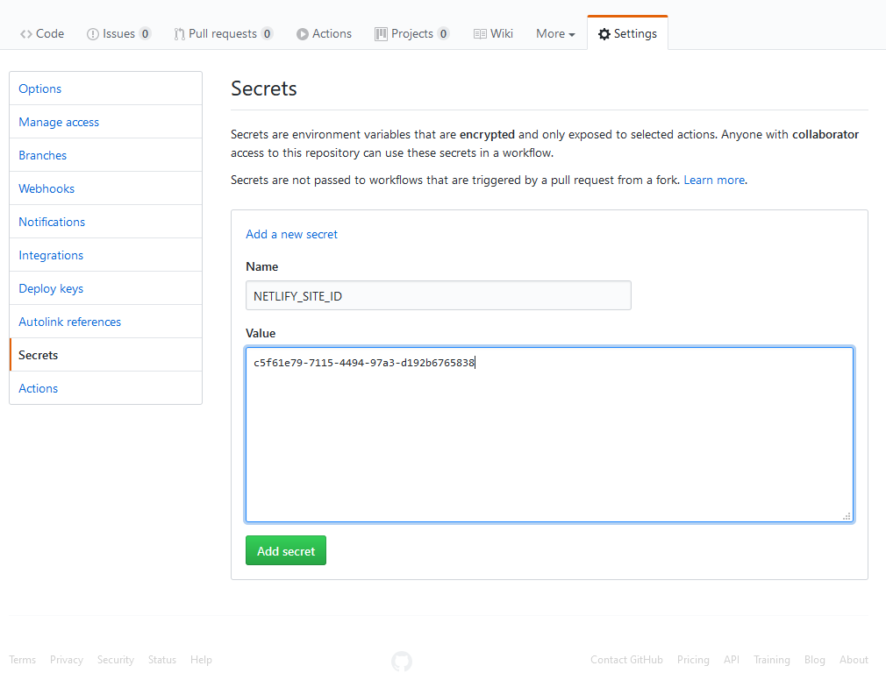

You have a site. You want to deploy it up to Netlify. As of late last year, Netlify added a cap of 300 "build minutes" on a free account. If your builds take a while or you deploy your site often, you can run into that cap very quickly. Instead, if you use GitHub Actions as your method of building a site and pushing to production, then you can build a very similar workflow at zero cost if your site is in a public repo. With this method, any time there is a commit to master, it will run a build and deploy to Netlify on your behalf.

First, let's get a site initially on Netlify. Let's assume you have a site you have a build step that is managed by NodeJS and the site hasn't been deployed anywhere yet but is in a GitHub repo already. Netlify's web dashboard offers a feature where if you drag in a built site locally onto their web interface, it will deploy it to their platform. Once this is done, on that new site, there is going to be a field in the settings panel of a site called `API ID`. It will be a series of numbers and letters separated by dashes. This is an identifier we will use with GitHub Actions to tell where to push build artifacts to on Netlify.



Next, if you click on your profile in the top right, go to user settings, applications, there is a field called `personal access tokens`. You will be able to create a secret token that you can authenticate to Netlify from GitHub with. This has full write access to your Netlify account so don't share it with anyone. If you click on the "new access token" button and enter the field, there will be a token that is generated for you. Write this down for later use.

Now in your site's repo, generate a new workflow file in the `.github/workflows` folder as follows:

```yaml title=.github/workflows/deploy-on-push.yml
name: Deploy to Netlify on commits to master
on:
  push:
    branches: [master]
jobs:
  build:
    runs-on: ubuntu-latest
    steps:
      # Checkout repo
      - uses: actions/checkout@v2

      - name: Install Dependencies
        run: npm install

      - name: Build site
        run: npm run build

      # Deploy the site with netlify-cli
      - name: Deploy Site
        env:
          NETLIFY_SITE_ID: ${{ secrets.NETLIFY_SITE_ID }}
          NETLIFY_AUTH_TOKEN: ${{ secrets.NETLIFY_AUTH_TOKEN }}
        run: npx netlify-cli deploy --dir=public --prod
```

Going through each section of the file, you only trigger the workflow using the `push` event with a filter that it is only the `master` branch. Then, you checkout the repo with the [actions/checkout](https://github.com/actions/checkout) action. This is assumed to be a NodeJS environment so you install dependencies and then run `npm run build` to build your site. Finally, you can use the [netlify-cli](https://www.npmjs.com/package/netlify-cli) to actually deploy your site.

With that deploy, we are going to insert a few environment variables with the `env` field in the last step so Netlify can authenticate properly and pass the build to the correct site. `NETLIFY_SITE_ID` is going to be the `API ID` that was from Netlify dashboard from earlier and `NETLIFY_AUTH_TOKEN` is the `personal access token` that was generated. To give GitHub these tokens, they have to be put into the repo's secrets store. Go to the repo settings on GitHub and click on "secrets" and enter the two strings where the key is the environment variable names described in the workflow YAML and the value is the actual secret.



Once both tokens are saved on GitHub, make a new commit and once there's a new commit on master, the workflow will trigger and build and deploy the site automatically.
