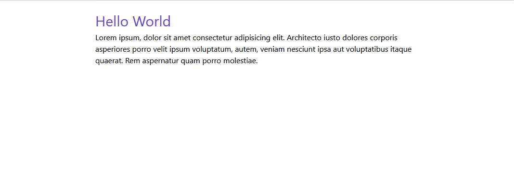
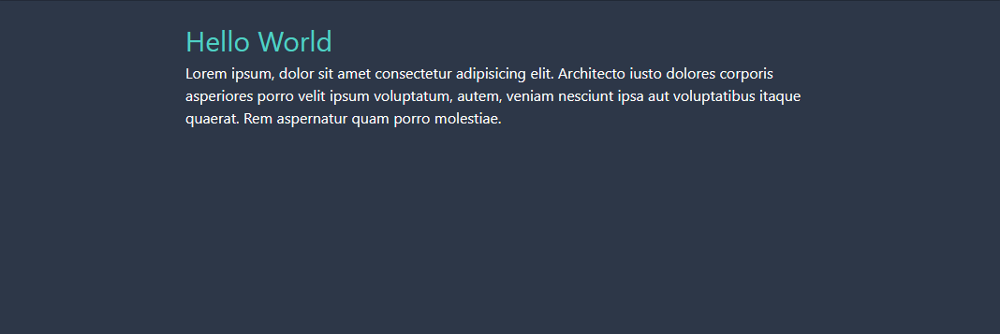

When using Tailwind, you may want to add functionality to integrate a dark mode into the site. By default Tailwind does not provide this, but there is a plugin you can add into your workflow to enable this. [tailwindcss-dark-mode](https://github.com/ChanceArthur/tailwindcss-dark-mode/) drops in various variants (`dark:`, `dark-hover:`, etc) to just append more utilities to your components when in a dark mode.

To load tailwindcss-dark-mode into Tailwind, install the npm module and then add a `require` call for the module in the `plugins` field of the Tailwind config and immediately invoke it.

```js title=tailwind.config.js
module.exports = {
  theme: {},
  variants: {},
  plugins: [require('tailwindcss-dark-mode')()],
}
```

Following, you need to tell Tailwind what utilities you want to use the `dark` and subsequent variants (If you don't know about custom variants, check out [Tailwind Docs - Configuring Variants](https://tailwindcss.com/docs/configuring-variants/)). If we want to add the default dark and a dark hover state to append to `backgroundColor` and `textColor`, the following would be done:

```js title=tailwind.config.js
module.exports = {
  theme: {},
  variants: {
    backgroundColor: ['hover', 'responsive', ' focus', 'dark', 'dark-hover'],
    textColor: ['hover', 'responsive', 'focus', 'dark', 'dark-hover'],
  },
  plugins: [require('tailwindcss-dark-mode')()],
}
```

Then, this plugin will trigger utilities when the `mode-dark` class is around. With a snippet of JS, you can use the [window.matchMedia](https://developer.mozilla.org/en-US/docs/Web/API/Window/matchMedia) function and check if the `prefers-color-scheme` media query would trigger to add a class to the root element.

```js
function checkDarkMode() {
  if (
    window.matchMedia &&
    window.matchMedia('(prefers-color-scheme: dark)').matches
  ) {
    return true
  }
  return false
}

if (checkDarkMode()) {
  document.documentElement.classList.add('mode-dark')
} else {
  document.documentElement.classList.remove('mode-dark')
}
```

Finally, if we add some classes to an HTML page (or whatever template language / framework you are using for your website), if you add `dark:` in front of various classes, it will trigger when in dark mode:

```html title=index.html
<body class="dark:bg-gray-800">
  <div class="max-w-2xl my-5 mx-auto dark:text-white">
    <h1 class="text-3xl text-purple-700 dark:text-teal-400">Hello World</h1>
    <p>
      Lorem ipsum, dolor sit amet consectetur adipisicing elit. Architecto iusto
      dolores corporis asperiores porro velit ipsum voluptatum, autem, veniam
      nesciunt ipsa aut voluptatibus itaque quaerat. Rem aspernatur quam porro
      molestiae.
    </p>
  </div>
</body>
```




