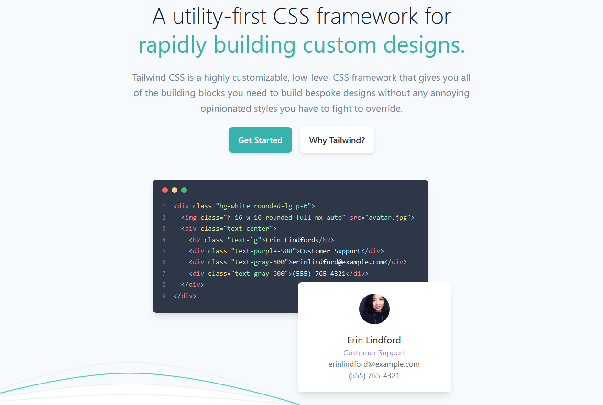
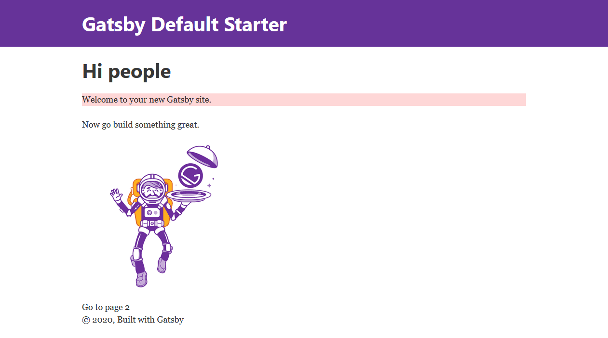

TailwindCSS is a CSS framework which instead of defining named classes and adding a CSS rule with various properties on it, you use constructed CSS classes which will apply styles for you.



To add it to Gatsby, there is a very small amount of work needed to be done. This workflow will walk through using it PostCSS.

Let's begin with gatsby-starter-default as a starting ground for this project.

```
npx gatsby new tailwind-starter
```

Once the site is created, we'll need a few libraries to get Tailwind going. Install `gatsby-plugin-postcss`, and `tailwindcss`. `gatsby-plugin-postcss` needs to be added to the `gatsby-config.js` file with no options:

```shell
yarn add tailwindcss gatsby-plugin-postcss
```

```js title=gatsby-config.js
// ...
module.exports = {
  plugins: [`gatsby-plugin-postcss`],
}
// ...
```

Create a `postcss.config.js` file to add tailwind as a plugin to PostCSS

```js title=postcss.config.js
module.exports = () => ({
  plugins: [require('tailwindcss')],
})
```

Add a `tailwind.config.js` if you wish to add plugins to Tailwind / configure or customize the defaults.

```js title=tailwind.config.js
module.exports = {
  // Customize default color palette, font stacks, type scale, etc
  theme: {},

  // control variants generated for utility plugins (hover, active, focus, etc)
  variants: {},

  // add Tailwind plugins for additional functionality
  plugins: [],
}
```

Then create a CSS file which will have a few lines of code that PostCSS will process into the default styles that come with Tailwind.

```css title=src/styles/tailwind.css
@tailwind base; /* Include base styles & normalize.css as a style reset */
@tailwind components; /* inject component classes by Tailwind & plugins */
@tailwind utilities; /* inject utility classes by Tailwind & plugins */
```

Load it in with `gatsby-browser.js`:

```js title=gatsby-browser.js
import './src/styles/tailwind.css'
```

Then if you enter a page and start adding classes, they will be applied. Add `bg-red-200` as a class to the first `<p>` tag on the page.

```jsx title=src/pages/index.js
// ...

const IndexPage = () => (
  <Layout>
    <SEO title="Home" />
    <h1>Hi people</h1>
    <p className="bg-red-200">Welcome to your new Gatsby site.</p>
    <p>Now go build something great.</p>
    <div style={{ maxWidth: `300px`, marginBottom: `1.45rem` }}>
      <Image />
    </div>
    <Link to="/page-2/">Go to page 2</Link>
  </Layout>
)
```

And it will appear here:



# Optimize The final build

If you then deploy this site, there will be a 750kb CSS file outputted which is a lot of styles you aren't using. If you want to reduce this, [add PurgeCSS to the gatsby project](/blog/2020-04-05-tailwind-purgecss/).
