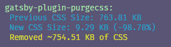

Tailwind is a powerful tool, but out of the box, it outputs a huge CSS file around the size of 750kb. By adding a library called PurgeCSS to your workflow, it can get rid of any css classes from Tailwind you do not use.

In Gatsby, there's a plugin convienently named `gatsby-plugin-purgecss` that you can add to your site. If you install it and add it to your `gatsby-config`, you can tell it Taiwlind exists in the project and it will handle the rest.

```js title=gatsby-config.js
module.exports = {
  // ...
  plugins: [
    `gatsby-plugin-postcss`,
    {
      resolve: `gatsby-plugin-purgecss`,
      options: {
        tailwind: true,
      },
    },
  ],
}
```

If you are running `gatsby develop` all of the classes will be available, but if you run `gatsby build`, PurgeCSS will trigger and get rid of any styles that aren't used and greatly reduce the outputted CSS file's size.


