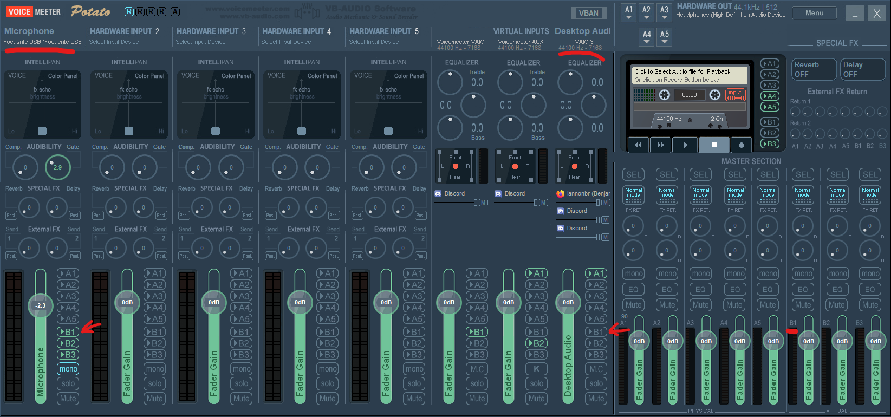
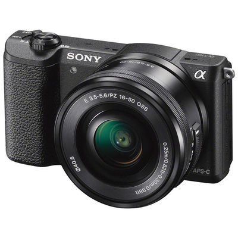
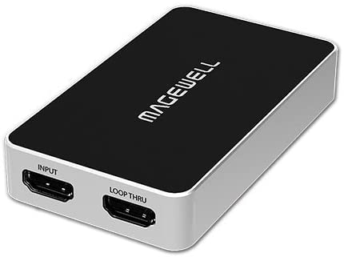
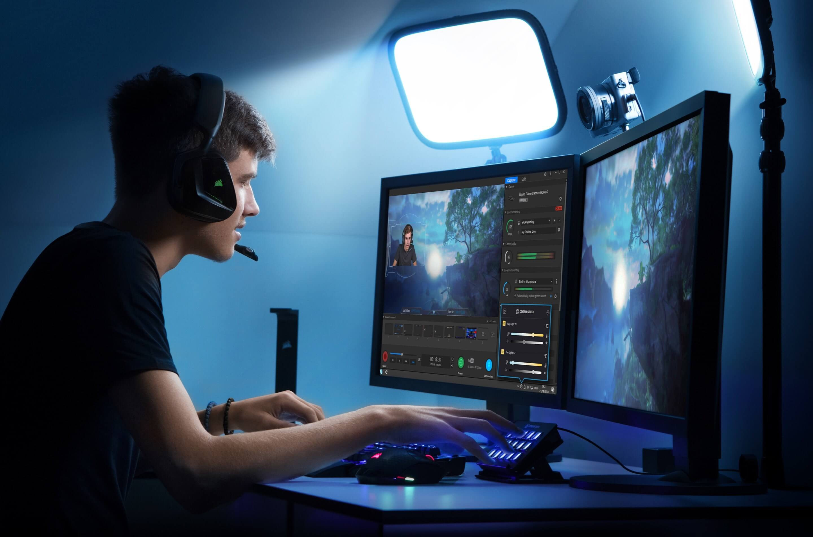
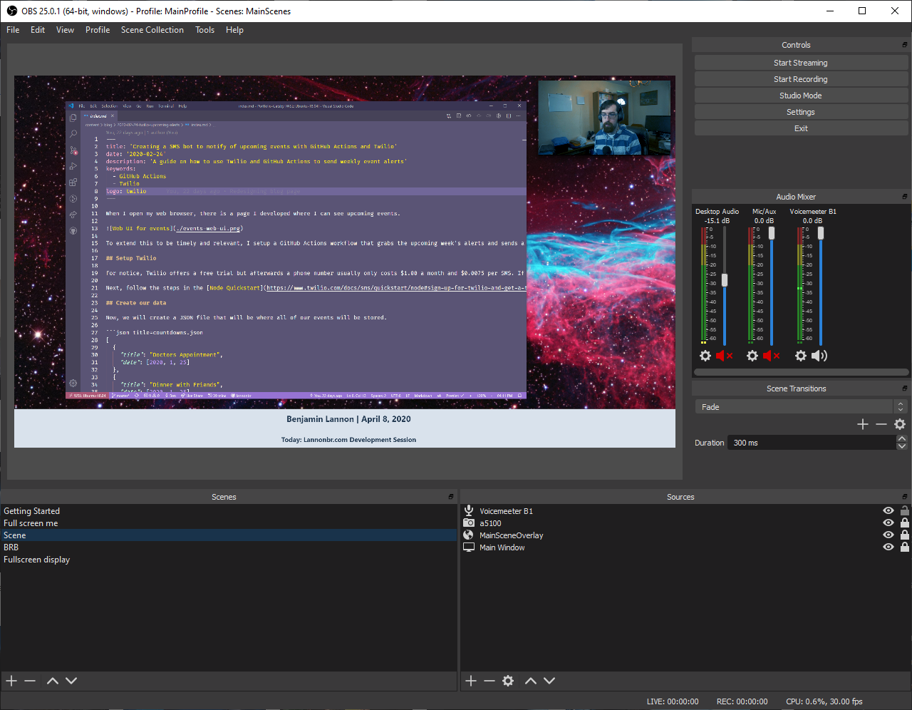
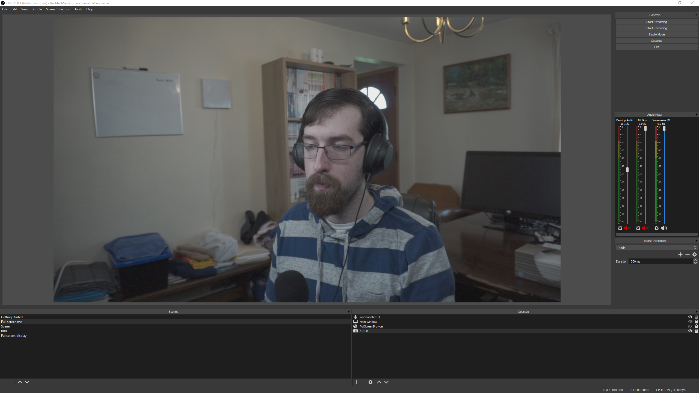
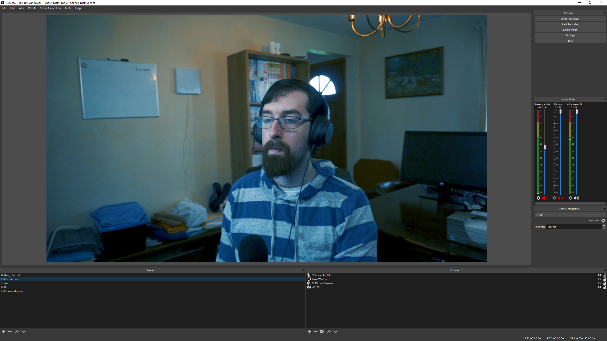
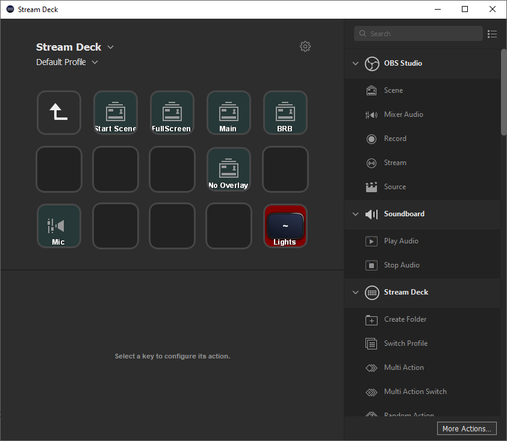

(Last Updated April 12, 2020)

As I've been streaming for awhile now, I wanted to create a resource for how I run my stream and mainly what equipment and software I am using to put the show together. This covers the majority of what I use and will be updated whenever I get new equipment.

## Computer

I'm currently running my setup on a custom Windows PC. It is running on 2019 components so there isn't any hiccups in terms of too much processing from the video encoding.

Some people when upgrading their setups use two computers where one is for development / gaming and the video output is sent to another PC, but given I am not 100% the CPU or GPU, I am just using the one PC. As well, I do all of my dev work in WSL which gives me a fairly similar environment if I was on a native Linux or MacOS machine.

Some of the main specs of the PC include:

- AMD Ryzen 7 3700x CPU
- Nvidia RTX 2070 SUPER GPU
- Samsung 970 Evo Pro NvMe M.2 1TB SSD
- Corsair Vengeance 3200MHz DDR4 RAM - 32GB (2x16GB)

## Audio

for my audio I started out with the Blue Yeti microphone when I did a first upgrade away from the microphones in the standard apple headphones. It was good for a portion of time, but over time I wanted to reduce the background noise around me as my workstation is in the dining room of my home and I dove into looking around at some dynamic mics which pick up a lot less background sound than a condenser mic like the Yeti.

I am currently using a Shure SM58 XLR mic to capture my voice for my streams. With it, I needed some more equipment as I can't plug in a USB cable between it and the computer. This is where I have a Cloudlifter and Focusrite Scarlett Solo. I use the Cloudlifter as an amplifier for the mic and then route that to the Focusrite which will convert the analogue audio into a digital format that is passed over USB into my computer.

Once it's available as an input on my PC, rather than dropping the direct audio input into my broadcasting software, I move it over into a program called Voicemeeter which allows me to do some mixing & routing of various audio on my machine.

Currently, the mic which is in the first column routes to various virtual outputs (B1, B2, B3). Voicemeeter also installs some virtual inputs so I can route my system audio into the column under VBAN labelled VAIO 3. If I wanted to route that audio to one of the virtual outputs as well, I just need to toggle one of the B buttons in that column. With this, if I had a soundboard or audio from a voice call, I can route that around the same way I do with my mic. Finally, my current setup with my broadcasting software uses the B1 output as a input so whatever is routed to B1 will be audible on stream.

## Video

From going from an Apple MacBook webcam to a Logitech C922, I currently landed with an entry level mirrorless camera of the Sony a5100. At under 500 USD it's a small camera but a much larger body than most USB webcams which allows for a lot better image processing.

As well I am currently using the base kit lens at a F3.5 16mm focal length, but I can upgrade the lens separate from the body so down the road I can improve in the quality without needing to buy another camera.

With the camera, I went into the settings and reduced the saturation, contrast, and sharpness down to give a dull and flat look from the sensor itself, but I'll later discuss how I can color grade the image in my broadcasting software to bring back some color and give it a unique feel.

In terms of other peripherals with the camera, I am using an Elgato Multimount to position it up in the air so it is at around eye level. As well, to make sure it is on all the time, I have "dummy battery" which is a device I connect to AC power and plop into the battery slot of the camera which keeps it from not shutting down in the middle of a stream.

Finally, to properly connect this to my PC, the Sony a5100 has a mini-HDMI port that I can route to a capture card. A pro to using the alpha series from Sony is that they output "clean HDMI" which means the overlay you usually see on a camera to describe the focal length, ISO, and other metrics are not exported as part of the output.

I'm currently using a Magewell USB Capture HDMI plus capture card that has a loopthru so if I wanted to montior the camera out, I can route the video to both my PC and another monitor. Now it is accessible as a webcam input on my PC and can be used in any app needing a video input source.

## Lighting

With the upgraded camera, it wasn't going to work well unless I was lit up properly. In terms of lighting for a stream, a reasonable setup has the subject well lit to give a professional feel. There are various setups here where you can get bright LEDs and have diffusing boxes or covers for a fairly inexpensive cost, but I wanted a setup that was fairly compact. What I ended up with was a set of the Elgato keylights. They aren't cheap lights in any sense, but they allow me to get customization of the brightness and color tempature on my PC or streamdeck so I don't have to deal with just one brightness setting or have additional remotes and devices for the lights.

The lights I have at a fairly low brightness given they are relatively close to me and I don't want to over expose myself. As well, I have them at different brightnesses so I have one light my face and the other can fill in the shadows.

## OBS

To broadcast out to Twitch, I use OBS as my main entrypoint. It can insert all of my various sources like my camera, audio from voicemeeter and other inputs and then push a composited stream up to Twitch.

OBS allows you to have multiple scenes so you can go between things like having the desktop be the center of attention or a fullscreen cam view or scenes when you are away from the computer. I currently have 5 scenes I flip through in my stream:

- A Starting Soon scene
- A scene where I have the camera be fullscreen
- A main scene where I have the desktop be fullscreen and my camera in a corner
- A main scene but without the camera or overlay if I want to display just my desktop
- A BRB scene

With that, I have an overlay at the bottom of the screen which is just loading in a webpage hosted on Netlify. I currently have the date and the topic for the stream in it, but given it is just a webpage, I can enhance it dramatically to add things based on webhooks or if I push buttons.

Finally, as I said earlier, I can color grade my video live in OBS. OBS offers supports for what is called a Lookup Table or LUT which changes the look and feel of the video.

Without the LUTs in place, the video looks rather dull and not too attractive to look at:

but I wanted to give it a look with a cool tempature and increase the blues in the image so with some work in Premiere Pro, I created a LUT that did such. It's not perfect but it allows me to customize how I want the video to look in the end.

LUTs also can customize the look to act like other cameras so if I wanted it to look like I was taking a video on a Canon or a Nikon or have a cinematic look like a RED camera, I can do that in the video processing using these LUTs.

## Stream Deck

I had the Stream Deck from Elgato before I even started streaming as I used it as a productivity device in apps like VS Code, but it really is useful in terms of controlling a stream.

For my main usage, I have all of my scenes as buttons so I can easily swap to any of them. In the bottom left is a mute toggle for my audio so if I want to mute the sound for a moment, I can do such. Finally the button in the bottom right is for my Elgato keylights where I can toggle them on and off so I can turn the lights on before my stream and off at the end.
