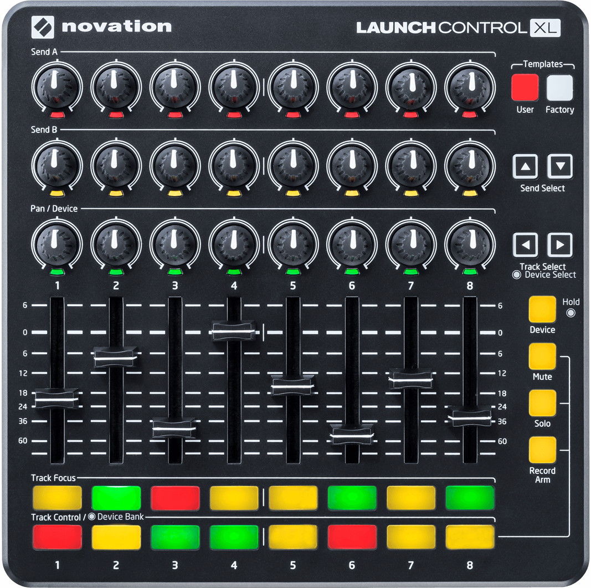

MIDI controllers are well known in the sound design production industry to be able to control software like Ableton Live or interact with sythesizers. With the livestreaming industry booming, it's possible to use this equipment as well with tools like OBS Studio. lebaston100 on GitHub created a python script that enables interactions between a MIDI controller and OBS called [MIDItoOBS](https://github.com/lebaston100/MIDItoOBS). Using the [OBS-websocket](https://github.com/Palakis/obs-websocket) plugin, MIDItoOBS can send button presses, faders, or knobs signals to OBS Studio to control scenes and sources.

For a demo, I am using the [Novation Launchcontrol XL](https://novationmusic.com/en/launch/launch-control-xl) as an example controller. I'm hooking up one of the faders to control the positioning of my webcam in one of my scenes.



To start, clone the repo down and you have to make sure the OBS-websocket is installed. Install all of the dependencies for the python script with `pip install -r requirements.txt`.

Then connect your MIDI controller to your computer and make sure OBS is open. If you run `setup.py`, it will recognize any MIDI controllers plugged in and you can choose which one you want to setup. Then it will ask you to either move the fader / knob or press a button that you want to map to an action. If you press a button, it will give you a large variety of actions you can bind to it:

```
Select Action:
0: SetCurrentScene
1: SetPreviewScene
2: TransitionToProgram
3: SetCurrentTransition
4: SetSourceVisibility
5: ToggleSourceVisibility
6: ToggleMute
7: SetMute
8: StartStopStreaming
9: StartStreaming
10: StopStreaming
11: StartStopRecording
12: StartRecording
13: StopRecording
14: StartStopReplayBuffer
15: StartReplayBuffer
16: StopReplayBuffer
17: SaveReplayBuffer
18: PauseRecording
19: ResumeRecording
20: SetTransitionDuration
21: SetCurrentProfile
22: SetCurrentSceneCollection
23: ResetSceneItem
24: SetTextGDIPlusText
25: SetBrowserSourceURL
26: ReloadBrowserSource
27: TakeSourceScreenshot
28: EnableSourceFilter
29: DisableSourceFilter
30: ToggleSourceFilter
Select 0-30:
```

Otherwise, if you move one of the faders or knobs, it will first ask you what type you just moved and then will give you all of the actions for faders & knobs.

```
Select input type:
0: Button
1: Fader/Knob
2: Ignore
Select 0-2: 1

Select Action:
0: SetVolume
1: SetSyncOffset
2: SetSourcePosition
3: SetSourceRotation
4: SetSourceScale
5: SetTransitionDuration
6: SetGainFilter
Select 0-6:
```

We'll setup `SetSourcePosition`. It then asks what source you want to control:

```
Updating scene list, please wait
Scenes updated
0: Source 'GettingStartedBrowser' in scene 'Getting Started'
1: Source 'Voicemeeter B1' in scene 'Full screen me'
2: Source 'Main Window' in scene 'Full screen me'
3: Source 'FullScreenBrowser' in scene 'Full screen me'
4: Source 'a5100' in scene 'Full screen me'
5: Source 'Voicemeeter B1' in scene 'Scene'
6: Source 'a5100' in scene 'Scene'
7: Source 'MainSceneOverlay' in scene 'Scene'
8: Source 'Main Window' in scene 'Scene'
9: Source 'BRBBrowser' in scene 'BRB'
10: Source 'Voicemeeter B1' in scene 'Fullscreen display'
11: Source 'Main Window' in scene 'Fullscreen display'
Select 0-11:
```

Since this is positioning, choose either the X or Y axis to control. I'm going to choose the Y axis.

```
0: X
1: Y
Select Target to change (0-1): 1
```

As a note, faders and knobs can send a value between 0 and 127 so now when you enter a min and max value, it will map the range linearly.

I'm going to set my low output is going to be larger than my high output as I want the fader to act in reverse or as I have it in physical space. Making it move downwards in physical space will make my camera source move down as well.

```
Setup input scale
Select lower output value: 600
Select higher output value: 22
Saved control_change with control 84 for action SetSourcePosition on device 1
```

Once the setup is done, you can exit out of it with `CTRL+C`. If you run `main.py`, it will now send the mapped bindings you created in `setup.py` to OBS. Here's a demo of the final result where the rightmost fader controls my camera's Y positioning.

<Video videoSrc="https://www.youtube.com/embed/kpGyjv73-vU" videoTitle="MIDItoOBS Demo" />

This now can be extrapolated to any of the other various functionalities of MIDItoOBS and allow for further control of OBS even when OBS is not the focused app on your computer. As well this can be an alternative to a Stream Deck so if you want to use the buttons on a MIDI controller to change scenes or toggle sources, you can control it with any MIDI device.
