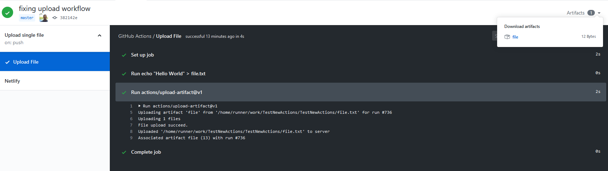

since Jobs are in completely isolated environments from each other, you can use Artifacts to move files between Jobs.

## Upload Artifacts

The [actions/upload-artifact](https://github.com/actions/upload-artifact) will take in some files, zip them up, and then have them exposed both to the runner in other jobs as well as to the user in the Actions web interface.

### Example

```yaml title=upload.yml
name: Upload single file
on: push
jobs:
  upload_file:
    name: Upload File
    runs-on: ubuntu-latest
    steps:
      - run: echo "Hello World" > file.txt
      - uses: actions/upload-artifact@v1
        with:
          name: file
          path: file.txt
```

This echo's some text into a file and then uses `actions/upload-artifact` to zip up the file and have it available in the runner with a key of `file`.

As well, now we can download it out of Actions onto our own machine if we wish:



## Download Artifacts

to pull these artifacts back in, you can use the [actions/download-artifact](https://github.com/actions/download-artifact) action. you pass in a param of `name` to then download the zip file with that key and it will extract the files into the workspace.

### Example

Taking the previous example, we can now add an additonal action and grab the file we uploaded and bring it back down and print it out.

Do note as we want to run the 2nd job after the first ends, we can use the `needs` field to define that `download_file` is dependent on `upload_file`.

```yaml title=up_and_down.yml
name: Upload and download single file
on: push
jobs:
  upload_file:
    name: Upload File
    runs-on: ubuntu-latest
    steps:
      - run: echo "Hello World" > file.txt
      - uses: actions/upload-artifact@v1
        with:
          name: file
          path: file.txt
  download_file:
    name: Download File
    runs-on: ubuntu-latest
    needs: upload_file
    steps:
      - uses: actions/download-artifact@v1
        with:
          name: file
      - run: cat file.txt
```
