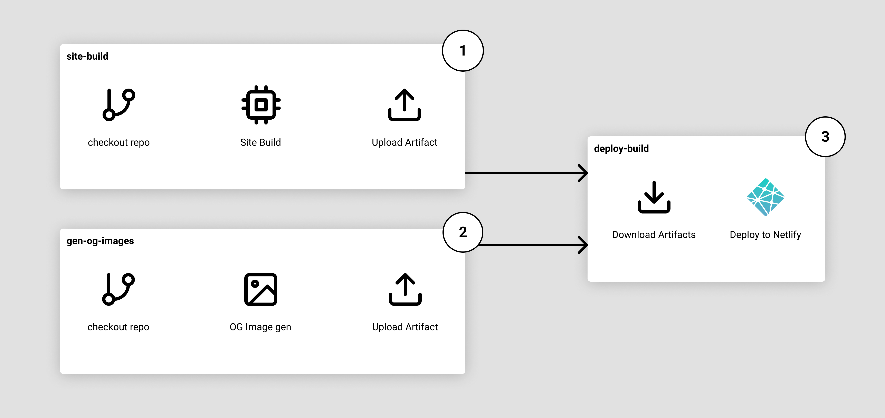

The work on the OpenGraph images is mainly based on [Chris Biscardi's](https://twitter.com/chrisbiscardi) Egghead Course: [Building an OpenGraph image generation API with Cloudinary, Netlify Functions, and React](https://egghead.io/playlists/building-an-opengraph-image-generation-api-with-cloudinary-netlify-functions-and-react-914e). The main difference is instead of building the images as part of a serverless function and caching them on Cloudinary, my implementation builds it in a GitHub Actions run, but decoupled from a site build.

## Workflow



1. A GitHub Actions Job to build the site.
2. A GitHub Actions Job to generate the images.
3. Take the artifacts from the previous jobs and deploy the content up to Netlify.

Each job here is all self-contained on separate VMs, so job #1 and #2 are can be run in parallel at the same time.

Starting, with the site build job, it's a direct workflow of pulling down the code, installing dependencies, building the site, and then using the [download-artifact](/blog/github-actions-artifacts) action to store the output files for use in another job. The inner-workings of what framework or library I'm using to "build" the site doesn't matter in this context.

```yaml title=build.yml
name: Build on push
on:
  push:
    branches: [master]
jobs:
  site-build:
    runs-on: ubuntu-latest
    steps:
      - uses: actions/checkout@v2
      - name: Install Deps
        run: yarn
      - name: Build Site
        run: yarn build
      - name: Upload public dir as artifact
        uses: actions/upload-artifact@v2
        with:
          name: public-dir
          path: public/
# ...
```

With the OpenGraph image generation, I also clone down the repo, and then run the process to build said action.

```yaml title=build.yml
# ...
gen-og-images:
  runs-on: ubuntu-latest
  steps:
    - uses: actions/checkout@v2
    - name: Build files
      run: |
        cd .github/actions/gen-og-images-action
        yarn
        yarn build
        node index.js
    - name: Upload files
      uses: actions/upload-artifact@v2
      with:
        name: og-images
        path: .github/actions/gen-og-images-action/dist/posts/
# ...
```

And then bundle the two up and deploy to Netlify.

```yaml title=build.yml
# ...
deploy-build:
  needs: [gen-og-images, site-build]
  runs-on: ubuntu-latest
  steps:
    - uses: actions/checkout@v2
    - name: get public dir
      uses: actions/download-artifact@v2
      with:
        name: public-dir
        path: public
    - name: get og-images dir
      uses: actions/download-artifact@v2
      with:
        name: og-images
        path: public/og-images/blog/
    - name: Deploy Site
      env:
        NETLIFY_SITE_ID: ${{ secrets.NETLIFY_SITE_ID }}
        NETLIFY_AUTH_TOKEN: ${{ secrets.NETLIFY_AUTH_TOKEN }}
      run: |
        yarn global add netlify-cli@2.58.0
        "$(yarn global bin)/netlify" deploy --dir=public --prod
```
