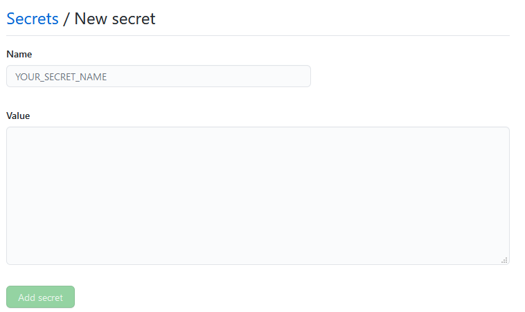

When working with GitHub Actions, you may want to use private tokens or other types of credentials that shouldn't be exposed publicly. Secrets can resolve this by being able to store these credentials in GitHub.

<Warning>A secret, although encrypted, will be available to anyone who has write access to the direct repo. This is not an issue for forks though as GitHub Actions in a fork will run on the forked repo with its own set of secrets rather than the upstream repo's secrets.</Warning>

To add a secret to a repo, in the `Settings` tab, click on `Secrets`. Then when one clicks on the "New Secret" button in the top right, it will present a form to add a new secret.



When you submit the secret, it then will be able to be used in your GitHub Actions.

Let's say we have to authenticate with a service like Netlify to deploy our site using their CLI, it requires a `NETLIFY_AUTH_TOKEN` to be able to push the contents to their platform. If we have this token saved in the GitHub Actions Secrets store, we can then obtain it in our workflows as such:

```yaml title=deploy.yml highlight={4}
steps:
  - name: Deploy Site
    env:
      NETLIFY_AUTH_TOKEN: ${{ secrets.NETLIFY_AUTH_TOKEN }}
    run: ntl deploy
```

As well, GitHub Actions Secrets can be uploaded, updated, or deleted through GitHub's API. For information on how to use the various endpoints, visit [docs.github.com](https://docs.github.com/en/rest/reference/actions#secrets).
