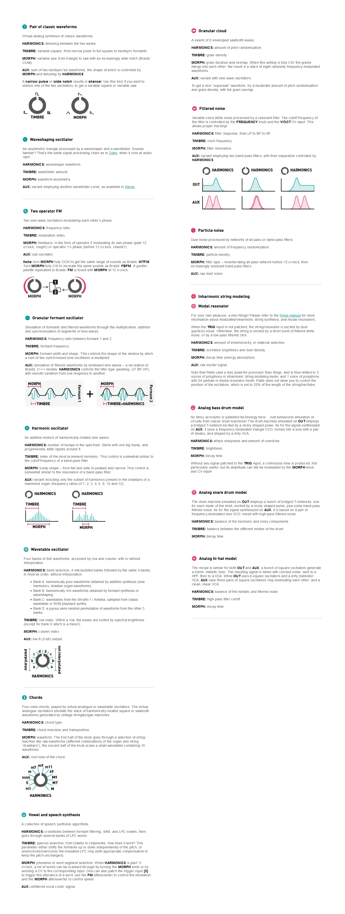
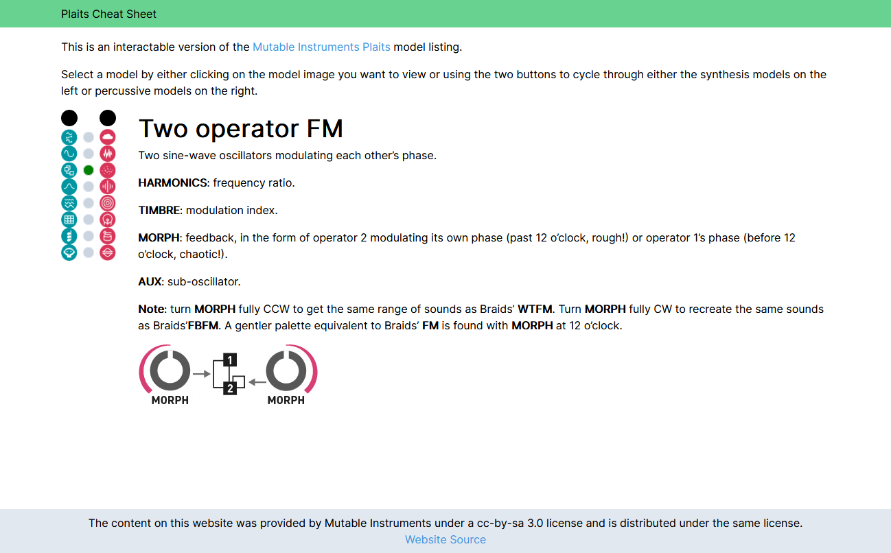

In the world of Modular Synthesis, the chain of modules that result in audible sound can begin with an oscillator. This could consist of analog or digital modules that send out a wave in the average audible frequency range (20 Hz to 20 kHz). These can come in all shapes and sizes, but for my journey, the [Mutable Instruments Plaits](https://mutable-instruments.net/modules/plaits/) was a good starting point as it gives a wide array of 16 sounds that can be sent through a modular system.

Through the tinkering of what this module can do, I frequently went through its manual to better learn the capabilities of each sound source, or model as they call it. The page was in-depth, but I was curious in focusing on the models themselves and what parameters can be changed by the three knobs on Plaits, `Harmonics`, `Timbre`, and `Morph`, which differ in usage from model to model. The manual went one by one succintly, but if I wanted to go immediately to a specific model, I would either have to search for it or scroll down to it. I thought of ways that I could enhance the experience of visualizing the docs.

## Round 1: A static cheatsheet

  
View cheat sheet image

Starting out I took screenshots of each of the models and laid them out in [Figma](https://www.figma.com) in the format that they appear on the physical module. This served it's purpose of laying out the models, but focusing in further and deeper, I had the idea of what if I could mimic the UI of Plaits itself of two buttons that can cycle through the models. This lead me to develop a [React](https://reactjs.org/) site that does this.

## Round 2: An interactive site

[plaits-cheat-sheet.netlify.app](https://plaits-cheat-sheet.netlify.app) ended up being a more interactive approach as I could conditionally display the contents of a single model. As well, I mimic'd the physical interaction of plaits by hooking up two buttons to cycle through the models as if you were using plaits in real life.

The code is up on GitHub at [lannonbr/plaits-docs](https://github.com/lannonbr/plaits-docs) and I'm thinking about future plans of integrating sound clips so you can get a preview for each model and how it can be customized using the various parameters.
