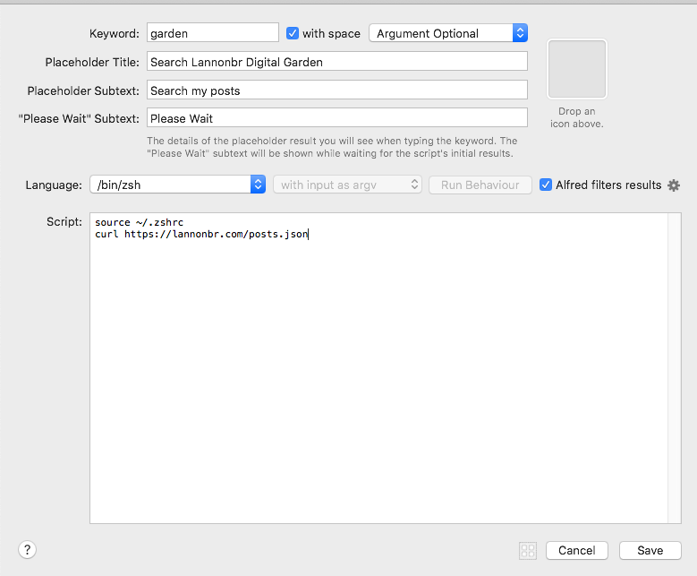
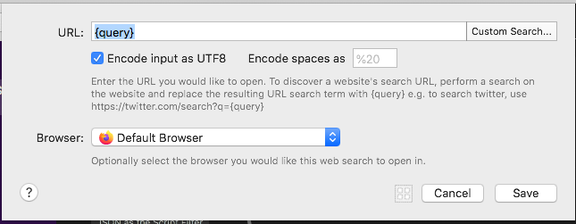
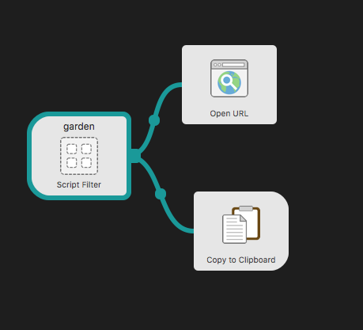
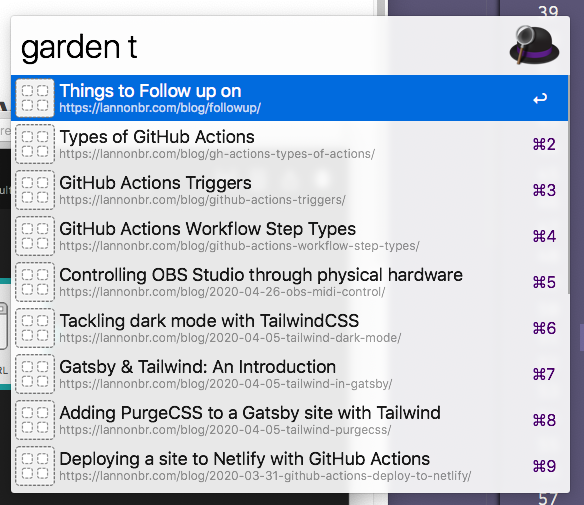

It started with an idea from [Roberttables](https://twitter.com/drpoindexter/), the more content one has in a [Digital Garden](https://joelhooks.com/digital-garden), the more content that can be referenced in conversations. The current workflow I have though is I have to go to my site, go to the listings of my posts, and find the one I want to link. Instead, I wrote up a workflow using [Alfred](https://www.alfredapp.com/) that allows me to search and navigate through my content faster.

## Creating our index

The entrypoint in Alfred for this workflow is a "script filter" which you pass it a script that returns JSON of the various items you want to search / filter through. For this, I generated a [posts.json](/posts.json) file that I ship up with my website. This is a subset of what the file looks like:

```json title=posts.json
{
  "items": [
    {
      "title": "Automating blogpost creation with Plop",
      "subtitle": "https://lannonbr.com/blog/plop-post-automation/",
      "arg": "https://lannonbr.com/blog/plop-post-automation/"
    },
    {
      "title": "ChefBrent Stream Highlights",
      "subtitle": "https://lannonbr.com/blog/chefbrent-highlights/",
      "arg": "https://lannonbr.com/blog/chefbrent-highlights/"
    },
    {
      "title": "Things to Follow up on",
      "subtitle": "https://lannonbr.com/blog/followup/",
      "arg": "https://lannonbr.com/blog/followup/"
    },
    {
      "title": "Frequently Used GitHub Actions",
      "subtitle": "https://lannonbr.com/blog/gh-actions-frequently-used-actions/",
      "arg": "https://lannonbr.com/blog/gh-actions-frequently-used-actions/"
    },
    ...
```

It is a JSON file that has an `items` array where each entry has a title, subtitle, and arg. The title is what appears as bold text in alfred while the subtitle is what appears below such, and then arg is what I pass along the alfred workflow.

This file was generated using the `createPages` api call in Gatsby, but it doesn't matter how this file is generated as long as you can create an array consisting of your post titles & URLs. There are [other options](https://www.alfredapp.com/help/workflows/inputs/script-filter/json/) for keys of each entry, but this is a base that I can work with.

## Creating the Workflow

Next, I create a new workflow in Alfred. As a trigger, I pull in Script Filter by right clicking and choosing `Inputs -> Script Filter`. Alfred gives you a variety of options such as the placeholder text when you are about to run it as well as the keyword which will trigger the workflow.



The meat of the input is running a script to get our JSON file from earlier. I write up a short ZSH script in their editor to run a curl command to get the JSON file.

```shell
source ~/.zshrc # source zsh environment
curl https://lannonbr.com/posts.json # get the JSON file
```

Then, I create a new object off of the Script Filter to open the result of the filter in a web browser. With the `Actions -> Open URL` action, I grab the output of the filter by using `{query}`. as the input.



As well, I can add a second output to copy the url to my clipboard with the `Output -> Copy to Clipboard` object.



In summary, we have one input trigger for the workflow that fetches a JSON array from my site, displays it in Alfred, and then when we choose it, it both opens the site in my browser and copies it to my clipboard so I can send it to someone over discord or any other chat app.

Here's the workflow in action:


