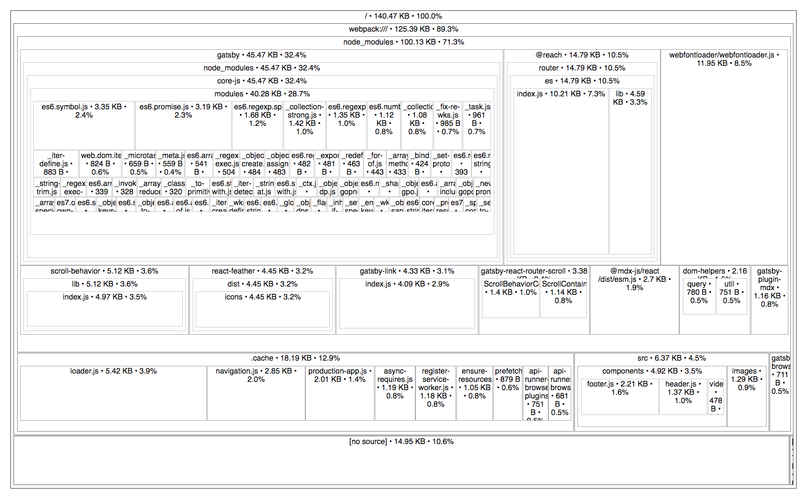

[danvk/source-map-explorer](https://github.com/danvk/source-map-explorer) offers a visual representation of any JavaScript bundle that also has a source-map. This will work across bundlers (Webpack, Parcel, Rollup, etc) as long as the bundle you want to analyze also has a source-map that can be passed along.

To use it, you can use `npx` in the terminal as follows where the two arguments are the bundle and the source-map.

```shell
npx source-map-explorer bundle.js bundle.js.map
```

Below is an example of it being run on my own website's app.js file which is a bundle that includes clientside JS that is used for my Gatsby Site.



In this particular example, you can see some large portions of the bundle:

- `core-js` inside `gatsby` (32%): This is for polyfills for older browsers (IE11).
- `@reach/router` (10%): The router Gatsby uses for clientside routing.
- `webfontloader` (8.5%): A loader to grab fonts from external sources and load them into my site.

Now where this could come in handy to do this is to reduce code that isn't used but shipped down due to the way the code is bundled. Some examples could include:

- using a single function from `lodash`, but the final bundle has all of Lodash.
- using AWS Amplify's clientside framework, but only using one chunk of it (for instance, Analytics), and not the rest (Auth, Storage, etc).

Being able to vizualize the bundles exposes places where optimizations can be made and reduce the amount of JS that is needed to be shipped and parsed down to an enduser.
