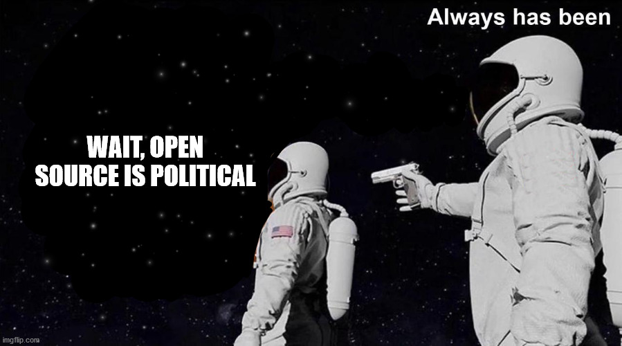

This is going to be notes for myself for the book [Working In Public](https://press.stripe.com/#working-in-public). The contents and thoughts on this page are mine on the topic unless it is a direct quote from the book.

## Introduction

- How can open source be sustainable, both financially and emotionally.
- what does it mean to create a community open to contributors and how can you retain those community members to contribute more?

> Open source code is public, but it doesn't have to be participatory. ~ Nadia (page 9)

This hits hard at home for many communities I've been a part of where there may be hundreds or thousands of people who "contribute" but active contribution is a much lower number.

> This distribution-where one or a few developers do most of the work, followed by a long tail of casual contributors, and many more passive users-is now the norm, not the exception, in Open Source. ~ Nadia (page 10)

Nadia is bringing up the developer ecosystem is becoming modularized, away from the monolithic structure of the past.

> ...These developers aren't building communities; they're directing air traffic ~ Nadia (page 13)

Nadia's commenting the maintainers have to balance the seesaw between making progress of their projects and the swath of people learning about said tool / needing help. The price of maintainers is their time.

They (users) at screaming at you, not for you for your time.

Open source was supposed to be collaborative, but it's become far from it.

### Thoughts on Introduction

Open Source in many instances is this one-to-many scenario where you can think at least in the web developer community, Kent C Dodds is synonomous with Testing, Dan Abramov is synonomous with React, and it goes to that even though there are tons of people making and creating things, we've entered a "consumption" world where there's always more users than creators.

Open Source touts "Oh anyone can submit issues or code contributions" but how accurate is that and how does that affect both someone coming into Open Source as well as the people managing the projects?

## Part 1 - How People Make: 01 - GitHub as a Platform

Git as a tool is relatively new in comparison to other version control systems (Created in 2005). Beforehand were centralized systems.

Origins of FOSS were in terms of free access to code, less about free in terms of cost. Brought forward through the 80s hacker culture.

Three pioneers in the day:

- Richard Stallman: Founder of the Free Software movement & GNU Project
- Eric S. Raymond: Writer of "The Cathedral and the Bazaar"
- Linus Torvalds: Creator of the Linux Kernel

Open source doesn't have a possesive sense (Which for particular projects I feel may be actually the opposite).

Permissive vs Copyleft licenses can arise to issues in the commercial space.

> "they (OSS devs) prioritize _convienence_ over freedom" ~ Nadia (page 30)

People care about the workflow more rather than having access to the source code of the cloud service. This reminds me of the debate of do you want something very custom, or something that works and lets you quickly solve your issues.

> Software licenses regulate _distribution_, but cannot _regulate_ production... ~ Steve Klabnik (page 33)

> "Coding became like tweeting" ~ Nadia (page 34)

I find it interesting Nadia introduces NPM as JavaScript's package manager on page 36, as it has become the defacto for frontend, backend, ui, etc, that is involved with JS. no longer just for node.

The big JS devs are known for the people they are, not the tools they build.

Funny enough, I wrote about Dan & Kent above and of course Nadia is bringing this up directly now.

## Thoughts on GitHub as a Platform

GitHub really transitioned "Open Source" to be a public space for people to contribute to software, rather than the traditional sense of it being a licensing / distribution tool. With GitHub exploding in popularity, it became a social network for devs, and with such, the cliques form, the celebs rise and fall, and the things we thought were stable may not be anymore.

## Part 1 - How People Make: 02 - The Structure of an Open Source Project

Being part of an open source community may not have all the technical / social norms of "The Open Source Community" as there are so many different subcommunities beneath that things differ from group to group.

The core of contribution is that anyone can suggest changes, but not everyone can approve said changes.

New features can span from a GitHub Issue, to a RFC (Request for Comments) to discuss if the feature _should_ be added, less on if it can be added.

"Maintainers" could be people who have merge access, or as well, those who just have influence. For some OSS projects, this could equate to "core maintainers" or "community maintainers". how one gains access to merge / commit access can vary based on leinent or strict guidelines & trust.

> At the time, [Lorenzo Sciandra] did not feel "good enough" to contribute to React Native ~ Nadia (page 48)

What does it even mean to be "good enough"? to contribute. People I've personally talked to sometimes see a big number of issues or pull requests and it seems daunting to contribute. It may be interesting to think why that's the case.

A repo is not just the code, but the community, discussions, and evolution of the project at large.

Other venues are also used in the process of using, creating, and discussing OSS projects: Slack, Discord, Stack Overflow, etc.

Early timelines of OSS Projects usually go in the order of:

1. Few people developing the project fairly privately / closed off. (Experimental tools may be open source but not always taking contributions from the outside yet)
2. promotion / growth of a Stablized version of the software. Getting more people involved both in using the tool as well as maybe contributing to it as well.

It's interesting Nadia comments that maintainence of a project (Issues, PRs, etc) is less fun than actually writing code. I could see the flip side of the phase of discussion could be invigorating at certain points.

Users are more familiar with GitHub's project management tools, so when projects move issues to other platforms, people can be put off.

Four Production Models

- High User Growth, High Contributor Growth: Federations (ex: Rust)
- High User Growth, Low Contributor Growth: Stadiums (ex: Babel)
- Low User Growth, High Contributor Growth: Clubs (ex: Astropy)
- Low User Growth, Low Contributor Growth: Toys (ex: ssh-chat)

Federations: The big & open & approachable projects, but given the scale are more complex in governance

Clubs: Niche projects where the people maintaining it are mainly the people using it

Toys: Self-explainitory, not used by many, also described in circles as "Pet projects"

Stadiums: The big projects, but sometimes daunting which lead to smaller contributor growth. Nadia makes a parallel with this to big twitch streamers.

The debate of whether the community should be centralized vs decentralized. should there be a small group calling the shots, or should it be more representative of it's audience.

### Thoughts on The Structure of an Open Source Project

At large, open source is a very diverse thing due to the nature of how different projects are. Do you have a project a few people are working on and they'll likely only be the only users, or do you have a small 12-line node script used by millions. What are the ramifications for strong / weak governance, and what happens when a project that should have a strong governance doesn't? Why do you think of an open source project as "daunting" or "approachable"?

## Part 1 - How People Make: 03 - Roles, Incentives and Relationships

Theory of the commons - working in public, outside the bounds of creating things for monetary purposes and more for personal / communal satisfaction.

> "The Rules that govern the commons should match the actual conditons" ... "those who violate the rules are subject to _graduated sanctions_.

Hmm, what happens when the following is broken by the maintainers themselves?

Social identity in online communities have existed from the early BB days all the way to modern social media & open source even. From lurkers, casual participants, active participants, and maintainers / moderators.

On the flip side of the Commons, it sometimes becomes a barrier of "us vs them" where there's a disconnect between maintainers & contributors, especially when OSS is company-based (ex: Vercel managing Next, Gatsby Inc, Facebook managing React, etc).

Back in the day, OSS was considered not "Real Software" by some, but now companies are clinging onto it and that can be a pro and con.

GitHub homogenized Open Source, but it did such as well as the rest of the tech giants and social medias did. We went from distributed to centralized.

Code of Conducts have been put in place for projects far and wide as there needs to be some ground level for acceptable behavior in a community.

Dear god with the opal-gate stuff. For context: [opal/opal#941](https://github.com/opal/opal/issues/941) one of the maintainers commented that "Tech is moral-less" which is a flat out lie.

When these situations arise, people could be biased to have a lower amount of trust based on maintainers reactions to emotionally charged scenarios. Alongside such, people get less trust in the maintainers when the maintainers did something wrong but don't think they did anything wrong.

At the end of the day, what are you doing to make people feel they are being accepted into a community?

**Contribution is not just code**

Maintainers sometimes are a collective, but sometimes a sole person. What happens when that sole person leaves said project?

Distinct between author & maintainer. Some want to just make, make, make, not maintain.

event-stream, leftpad, these situations happen again and again and again.

Contributors can be a one and done situation or a connection that grows. Do you want to solve a bug that you ran into, or get involved with the process of the tool itself. Are you benefiting yourself or the collective?

GitHub has made the casual contributor flourish due to lowering the barrier of entry. This though leads to disconnects of people not understanding the norms & leading to lower quality contributions that may take longer to review.

Contributor count is not the best metric in terms of the health of a project. I could say 50k people submitted a PR saying they are using my technology, but if I'm the only one actually developing it, 50k contributors isn't telling the whole story.

This also brings up other numerical metrics. I could have 3 million downloads for a npm package, but if 2.9999 million are just CI installs, I really don't have 3 million users. With all of this, qualitative insights from quantitative metrics have to be used to truly get a better understanding.

### Thoughts on Roles, Incentives and Relationships

Open source communities at large is about communication and trust. That trust can be easily broken and without guidelines, how can someone know a maintainer is trustworthy? As well, GitHub brought forward a place for the active contributor or casual user to put their voice on the same place, so with that, how do maintainers & communities setup systems for smooth processes so whether you're making your first contribution or your 50th, you can get the backing of the community to push towards the finish line.
